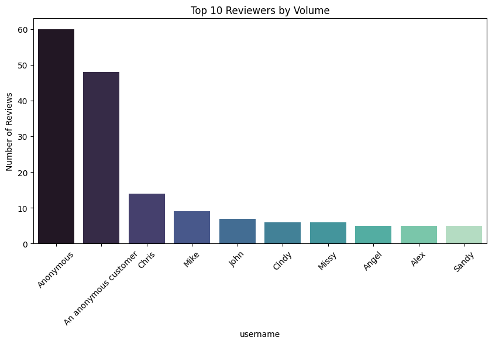

#  Exploratory Data Analysis (EDA) — Review Dataset

[](https://github.com/cwattsnogueira/rating-predictor-spam-detection-review-summarizer)


<a href="https://colab.research.google.com/github/cwattsnogueira/rating-predictor-spam-detection-review-summarizer/blob/main/02_eda_initial.ipynb" target="_parent">
  
</a>

---

##  Purpose

This notebook explores a cleaned product review dataset to uncover patterns, distributions, and potential modeling challenges. The goal is to guide feature engineering and anticipate issues like class imbalance, sparse signals, or noisy user behavior.

---

##  Folder Structure

```
├── 02-eda-initial/
│   ├── input/        # Contains cleaned_reviews.parquet
│   ├── notebook/     # This EDA notebook
│   ├── output/       # Saved plots (PNG) 
│   └── README.md     # This documentation
```

---

##  Input File

| File Name                | Description                              | Link |
|--------------------------|------------------------------------------|------|
| `cleaned_reviews.parquet`| Cleaned dataset from previous notebook   | [ View file](../01-data-loader-review-clean/output/cleaned_reviews.parquet) |

---

##  Output Plots

Each plot below is saved in `output/` and rendered directly here. These visuals help interpret key aspects of the dataset:

###  Distribution of Review Lengths
Detect short/long reviews, verbosity, and outliers.


###  Distribution of Review Ratings
Spot rating imbalance or skew.


###  Top 10 Brands by Review Count
Identify dominant brands in the dataset.


###  Top 10 Categories by Review Count
See which product types are most reviewed.


###  Product Additions Over Time
Understand product lifecycle and dataset age.


###  Rating by Purchase Status
Compare ratings from buyers vs. non-buyers.


###  Rating by Recommendation Status
See how recommendations align with ratings.


###  Helpful Votes (log) by Rating
Explore engagement vs. sentiment.


###  Reviews Over Time
Spot trends or seasonality in review activity.


###  Top 10 Reviewers by Volume
Identify prolific users and potential bias.


---

##  What the Code Does

- Loads the cleaned dataset from the previous pipeline
- Computes review length and visualizes its distribution
- Analyzes rating frequency and potential imbalance
- Highlights top brands and categories by review volume
- Performs temporal analysis on product additions and review activity
- Compares rating distributions across purchase and recommendation status
- Examines helpful vote engagement using log normalization
- Identifies top reviewers and flags potential overrepresentation
- Reports remaining missing values and duplicated review texts

---

##  Budget Justification

| Task                                   | Skill Area                  | Budget Rationale |
|----------------------------------------|-----------------------------|------------------|
| Review length analysis                 | NLP preprocessing           | High — signals verbosity and user effort |
| Rating distribution                    | Class imbalance detection   | High — guides modeling strategy |
| Brand/category frequency               | Business insight            | Medium — helps with segmentation |
| Temporal trends                        | Time-series awareness       | Medium — useful for lifecycle modeling |
| Behavioral boxplots                    | Ethical feature engineering | High — reveals bias and user silence |
| Helpful vote normalization             | Engagement modeling         | Medium — balances skewed data |
| Reviewer volume analysis               | User-level bias detection   | High — prevents overfitting to power users |

---

