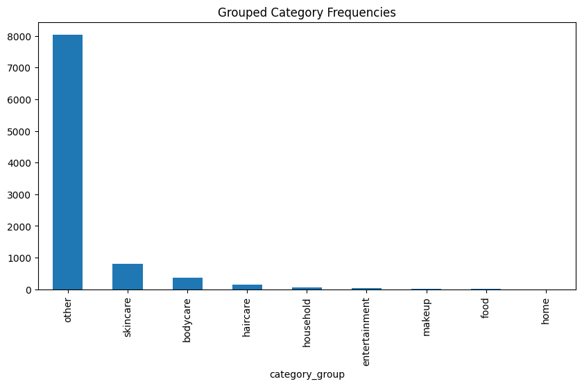

#  Category Cleaning and Normalization

[](https://github.com/cwattsnogueira/rating-predictor-spam-detection-review-summarizer)


<a href="https://colab.research.google.com/github/cwattsnogueira/rating-predictor-spam-detection-review-summarizer/blob/main/03_category_cleaning.ipynb" target="_parent">
  
</a>

---

##  Purpose

This notebook focuses on cleaning and normalizing the `categories` column in the review dataset. The goal is to reduce noise, standardize naming, and group semantically similar entries into broader product types — such as skincare, haircare, makeup, and more.

---

##  Folder Structure

```
├── 03-category-cleaning/
│   ├── input/        # Contains cleaned_reviews.parquet
│   ├── notebook/     # This notebook
│   ├── output/       # Enhanced dataset and visualizations
│   └── README.md     # This documentation
```

---

##  Input File

| File Name                | Description                              | Link |
|--------------------------|------------------------------------------|------|
| `cleaned_reviews.parquet`| Cleaned dataset from previous pipeline   | [ View file](../01-data-loader-review-clean/output/cleaned_reviews.parquet) |

---

##  What the Code Does

- Loads the cleaned review dataset
- Extracts the most specific tag from the `categories` column (`main_category`)
- Maps each `main_category` to a broader semantic group (`category_group`)
- Visualizes the distribution of grouped categories
- Saves the enhanced dataset with all three category-related columns

---

##  Rendered Plot

###  Grouped Category Frequencies
This bar chart shows how reviews are distributed across high-level product types. It reveals that most entries fall under `"other"`, followed by `"skincare"`, `"bodycare"`, and `"haircare"` — confirming that the original categories were highly granular.



---

##  Column Strategy

All three category-related columns are retained for flexibility and traceability:

- `categories`: preserves raw tags for auditability
- `main_category`: captures the most specific tag per entry
- `category_group`: provides simplified, interpretable grouping for modeling

---

##  Budget Justification

| Task                              | Skill Area                  | Budget Rationale |
|-----------------------------------|-----------------------------|------------------|
| Category parsing and extraction   | Text preprocessing          | Medium — reduces noise and redundancy |
| Semantic grouping via mapping     | Feature engineering         | High — improves interpretability and model readiness |
| Visualization of group frequencies| Data storytelling           | Medium — supports insight and validation |
| Retention of layered columns      | Ethical design, traceability| High — preserves auditability and modeling flexibility |

---

