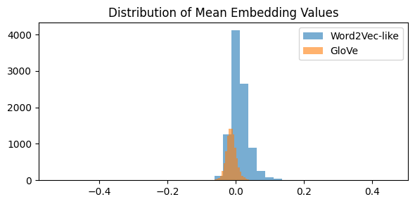

#  Text Embeddings with SVD & GloVe

[](https://github.com/cwattsnogueira/rating-predictor-spam-detection-review-summarizer)


<a href="https://colab.research.google.com/github/cwattsnogueira/rating-predictor-spam-detection-review-summarizer/blob/main/05_01_text_embeddings_SVD_GloVeVF.ipynb" target="_parent">
  
</a>

---

##  Purpose

This notebook generates two types of text embeddings from tokenized product reviews:

- **Word2Vec-like embeddings** using `CountVectorizer` + `TruncatedSVD`
- **GloVe embeddings** using pre-trained Stanford vectors (100d)

These embeddings are saved for downstream ML/DL tasks such as fake review detection, rating prediction, and semantic analysis. The goal is to create interpretable, reusable representations of review text while maintaining transparency and reproducibility.

---

##  Folder Structure

```
├── 05-01-text-embeddings-svd-glove/
│   ├── input/        # Required input files
│   ├── notebook/     # Jupyter notebook for this pipeline
│   ├── output/       # Saved embeddings and models
│   └── README.md     # This documentation
```

---

##  Input Files

| File Name                          | Description                                 | Link |
|-----------------------------------|---------------------------------------------|------|
| `engineered_features.parquet`     | Dataset with cleaned text and structured features | [View file](../05-feature-engineering/output/engineered_features.parquet) |
| `feature_names.json`              | List of selected structured feature names   | [View file](../05-feature-engineering/output/feature_names.json) |

---

##  Output Artifacts

| File Name                          | Description                                 | Link |
|-----------------------------------|---------------------------------------------|------|
| `tokenized_texts.pkl`             | Tokenized review texts                      | [Download](./output/tokenized_texts.pkl) |
| `X_word2vec.npy`                  | Word2Vec-like embeddings (SVD-reduced)      | [Download](./output/X_word2vec.npy) |
| `word2vec_vectorizer.pkl`         | Fitted CountVectorizer                      | [Download](./output/word2vec_vectorizer.pkl) |
| `word2vec_svd.pkl`                | Fitted TruncatedSVD model                   | [Download](./output/word2vec_svd.pkl) |
| `glove_embeddings.pkl`            | Loaded GloVe word vectors                   | [Download](./output/glove_embeddings.pkl) |
| `X_glove.npy`                     | GloVe-based review embeddings               | [Download](./output/X_glove.npy) |
| `embeddingvalues.png`             | Distribution plot of mean embedding values  | [View image](./output/embeddingvalues.png) |

---

##  Final Visualization

### Distribution of Mean Embedding Values

This plot compares the distribution of mean embedding values from both methods:

- **Word2Vec-like (SVD)**: Based on bag-of-words matrix reduced to 100 dimensions  
- **GloVe**: Based on averaging pre-trained word vectors per review



---

##  What the Code Does

- Loads cleaned review text and structured features
- Tokenizes review text into word lists
- Applies `CountVectorizer` with identity functions to preserve token structure
- Reduces dimensionality using `TruncatedSVD` to simulate Word2Vec-style embeddings
- Loads pre-trained GloVe vectors (100d) and computes average embedding per review
- Saves all embeddings and models for reuse
- Visualizes the distribution of mean embedding values across both methods

---

##  Budget Justification

| Task                              | Skill Area               | Budget Rationale |
|-----------------------------------|--------------------------|------------------|
| Tokenization & preprocessing      | NLP fundamentals         | High — preserves semantic structure |
| CountVectorizer + SVD             | Dimensionality reduction | High — enables compact representation |
| GloVe embedding integration       | Transfer learning        | High — leverages external semantic knowledge |
| Artifact saving                   | Workflow modularity      | High — supports reproducibility |
| Embedding comparison visualization| Data storytelling         | Medium — aids interpretability |

---

Let me know when you're ready to move on to the next README!
