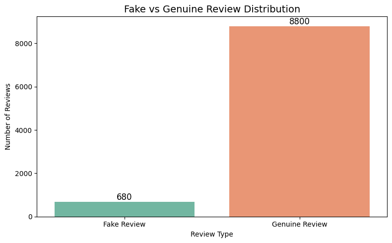
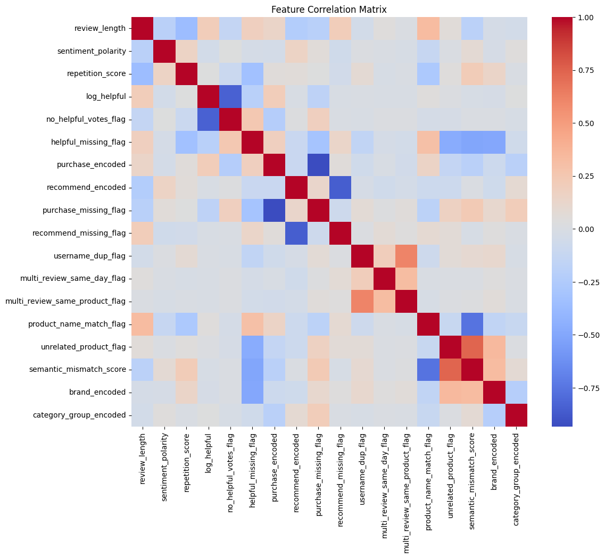

#  Feature Engineering for Fake Review Detection

[](https://github.com/cwattsnogueira/rating-predictor-spam-detection-review-summarizer)


[](https://colab.research.google.com/github/cwattsnogueira/rating-predictor-spam-detection-review-summarizer/blob/main/05_feature_engineering.ipynb)

---

##  Purpose

This notebook creates structured features from review metadata and cleaned text to support fake review detection. It generates a binary target (`fake_review_label`) based on behavioral, semantic, and linguistic signals, and prepares all inputs for ML and DL workflows.

---

##  Folder Structure

```
├── 05-feature-engineering-fake-review/
│   ├── input/        # Contains cleaned_reviews_with_text.parquet
│   ├── notebook/     # This notebook
│   ├── output/       # Saved features, labels, encoders
│   └── README.md     # This documentation
```

---

##  Input Files

| File Name                          | Description                                 | Link |
|-----------------------------------|---------------------------------------------|------|
| `cleaned_reviews_with_text.parquet` | Dataset with cleaned text and categories   | [ View file](../04-text-cleaning-vectorization/output/cleaned_reviews_with_text.parquet) |
| `X_count_vectorized.pkl`          | CountVectorizer matrix                      | [ View file](../04-text-cleaning-vectorization/output/X_count_vectorized.pkl) |

---

##  Output Artifacts

| File Name                          | Description                              | Download Link |
|-----------------------------------|------------------------------------------|----------------|
| `engineered_features.parquet`     | Full dataset with engineered features    | [ Download](./output/engineered_features.parquet) |
| `X_structured.npy`                | Structured feature matrix                | [ Download](./output/X_structured.npy) |
| `y_fake_review.npy`               | Binary target labels                     | [ Download](./output/y_fake_review.npy) |
| `feature_names.json`              | List of selected feature names           | [ Download](./output/feature_names.json) |
| `label_encoder_brand.pkl`         | LabelEncoder for brand                   | [ Download](./output/label_encoder_brand.pkl) |
| `label_encoder_category_group.pkl`| LabelEncoder for category group          | [ Download](./output/label_encoder_category_group.pkl) |
| `fake_review_labels.parquet`      | Final binary labels                      | [ Download](./output/fake_review_labels.parquet) |

---

##  Rendered Plot

###  Fake vs Genuine Review Distribution
This chart shows the balance between predicted fake and genuine reviews based on engineered rules.



---

##  What the Code Does

- Loads cleaned dataset and TF-IDF matrix
- Computes sentiment polarity and buckets it into categories
- Flags short reviews, repeated tokens, and duplicate usernames
- Detects semantic mismatches between review text and product name
- Encodes categorical features (brand, category group)
- Creates a binary target (`fake_review_label`) based on heuristics
- Saves structured features and labels for modeling

---

##  Feature Overview

| Feature Name                   | Description |
|-------------------------------|-------------|
| `review_length`               | Number of tokens in the cleaned review text |
| `sentiment_polarity`         | Polarity score from TextBlob (-1 to +1) |
| `repetition_score`           | Max normalized frequency of repeated tokens |
| `log_helpful`                | Log-transformed helpful vote count |
| `no_helpful_votes_flag`      | Binary flag for zero helpful votes |
| `helpful_missing_flag`       | Binary flag for missing helpful vote field |
| `purchase_encoded`           | Ordinal encoding of purchase status |
| `recommend_encoded`          | Ordinal encoding of recommendation status |
| `purchase_missing_flag`      | Binary flag for missing purchase info |
| `recommend_missing_flag`     | Binary flag for missing recommendation info |
| `username_dup_flag`          | User appears more than once in dataset |
| `multi_review_same_day_flag` | Same user reviewed multiple items on same day with same title |
| `multi_review_same_product_flag` | Same user reviewed same product multiple times |
| `product_name_match_flag`    | Review text overlaps with product name |
| `unrelated_product_flag`     | Review contains keywords from unrelated categories |
| `semantic_mismatch_score`    | Sum of product name mismatch and unrelated keyword flag |
| `brand_encoded`              | Label-encoded brand name |
| `category_group_encoded`     | Label-encoded product category group |

---

##  Feature Correlation Matrix

This heatmap visualizes the relationships between all structured features used in the fake review detection pipeline. It helps identify which features are strongly related, potentially redundant, or offer unique signals for modeling.

-  Blue tones indicate negative correlations  
-  Red tones indicate positive correlations  
-  Neutral tones (beige/white) indicate weak or no correlation  

###  Key Observations:
- **Username duplication flags** (`username_dup_flag`) show moderate positive correlation with both `multi_review_same_day_flag` and `multi_review_same_product_flag`, suggesting behavioral patterns linked to suspicious activity.
- **Semantic mismatch score** has weak positive correlation with both `product_name_match_flag` and `unrelated_product_flag`, reinforcing its role in detecting incoherent or off-topic reviews.
- **Review length** is slightly negatively correlated with `no_helpful_votes_flag`, indicating that shorter reviews tend to receive fewer helpful votes.

This matrix supports feature selection, model interpretability, and ethical transparency by revealing how different signals interact.



---

##  Budget Justification

| Task                          | Skill Area               | Budget Rationale |
|-------------------------------|--------------------------|------------------|
| Sentiment polarity & bucketing| Text analysis            | Medium — adds emotional signal |
| Semantic mismatch detection   | Feature engineering       | High — flags suspicious content |
| Repetition scoring            | Behavioral modeling       | Medium — detects unnatural patterns |
| Username duplication flags    | User-level bias detection | High — identifies review spam |
| Target label generation       | Heuristic modeling        | High — enables supervised learning |
| Categorical encoding          | ML preprocessing          | Medium — prepares for structured models |
| Artifact saving               | Workflow modularity       | High — supports reproducibility |

---


