#  EDA on Engineered Features

[](https://github.com/cwattsnogueira/rating-predictor-spam-detection-review-summarizer)


<a href="https://colab.research.google.com/github/cwattsnogueira/rating-predictor-spam-detection-review-summarizer/blob/main/06_eda_features.ipynb" target="_parent">
  
</a>

---

##  Purpose

This notebook performs exploratory data analysis (EDA) on engineered features used for fake review detection and rating prediction. It validates assumptions, visualizes distributions, detects bias, and ranks feature importance using a Random Forest model.

---

##  Folder Structure

```
├── 06-eda-features/
│   ├── notebook/     # Contains this EDA notebook
│   ├── output/       # Saved plots and visualizations
│   └── README.md     # This documentation
```

---

##  Input File

| File Name                      | Description                                 | Link |
|-------------------------------|---------------------------------------------|------|
| `engineered_features.parquet` | Dataset with structured features            | [View file](../05-feature-engineering/output/engineered_features.parquet) |

---

##  What the Code Does

- Loads the engineered dataset and selects key features for analysis
- Plots distribution histograms for each feature
- Computes and visualizes a correlation matrix including the target label
- Uses boxplots to compare feature distributions across fake/genuine labels
- Displays label balance using a countplot
- Trains a `RandomForestClassifier` to assess feature importance
- Visualizes ranked importance scores to guide modeling decisions

---

##  Features Analyzed

```python
[
  'review_length',
  'sentiment_polarity',
  'username_dup_flag',
  'product_name_match_flag',
  'unrelated_product_flag',
  'semantic_mismatch_score'
]
```

These features capture linguistic, behavioral, and semantic signals relevant to fake review detection.

---

##  Visual Outputs

All plots are saved in the `output/` folder and rendered below:

###  Feature Distributions

- 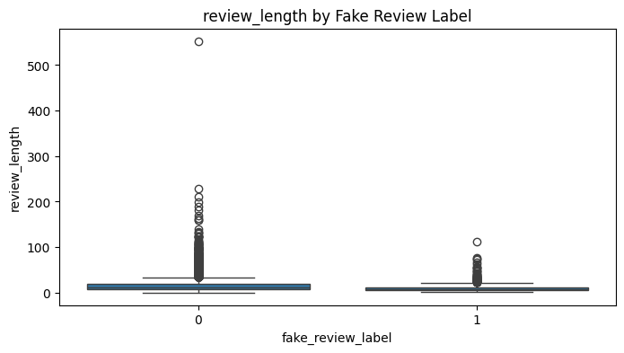
- 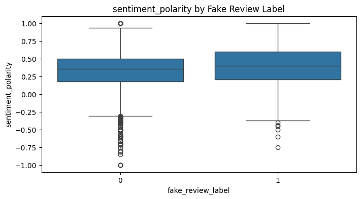
- 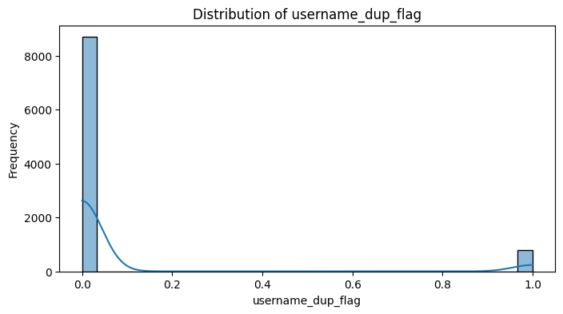
- 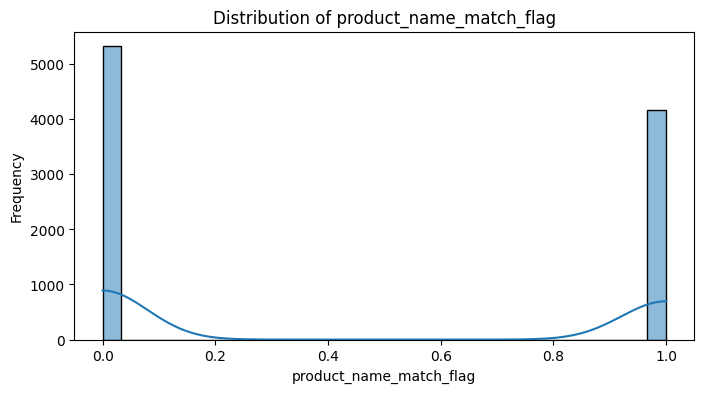
- 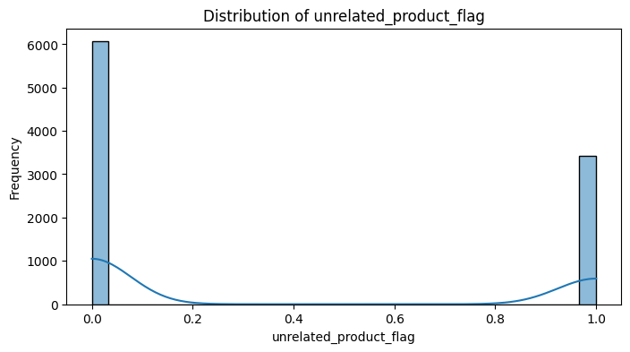
- 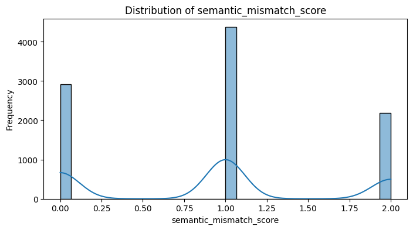

###  Label Comparison by Feature

- 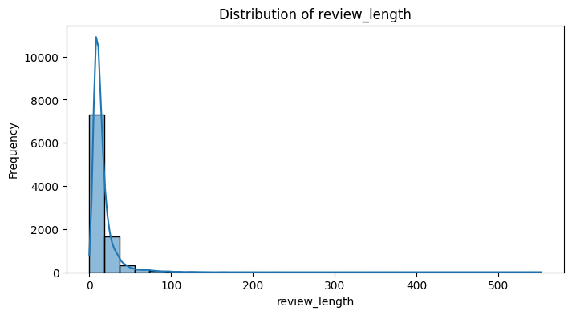
- 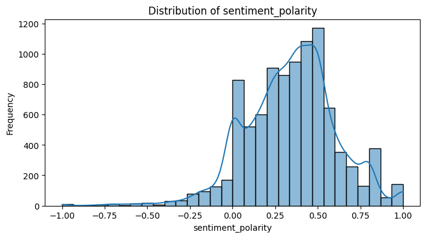
- 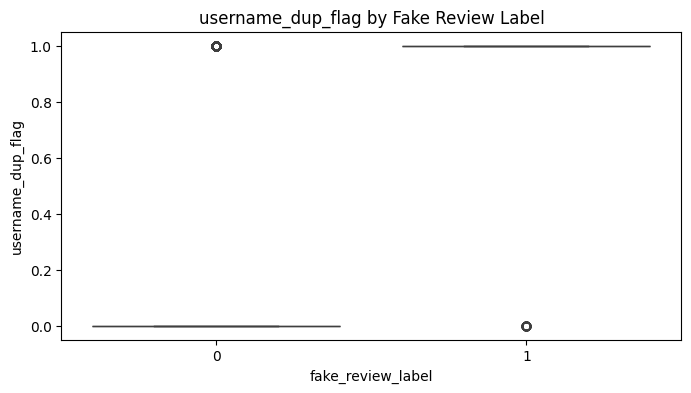
- 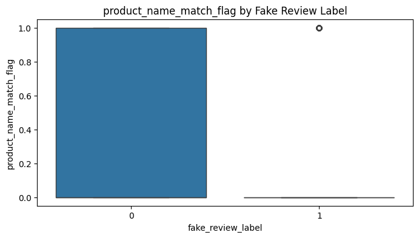
- 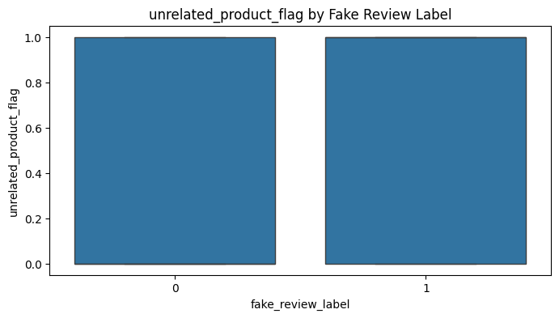
- 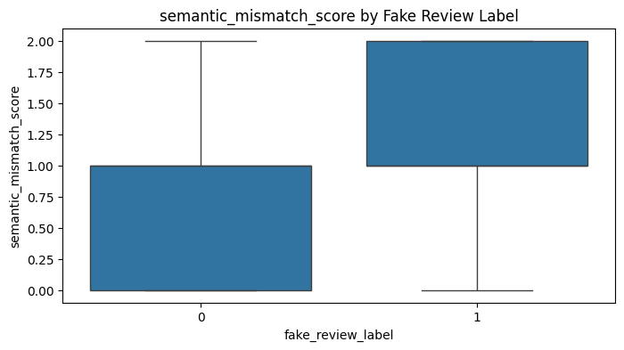

###  Correlation & Label Distribution

- 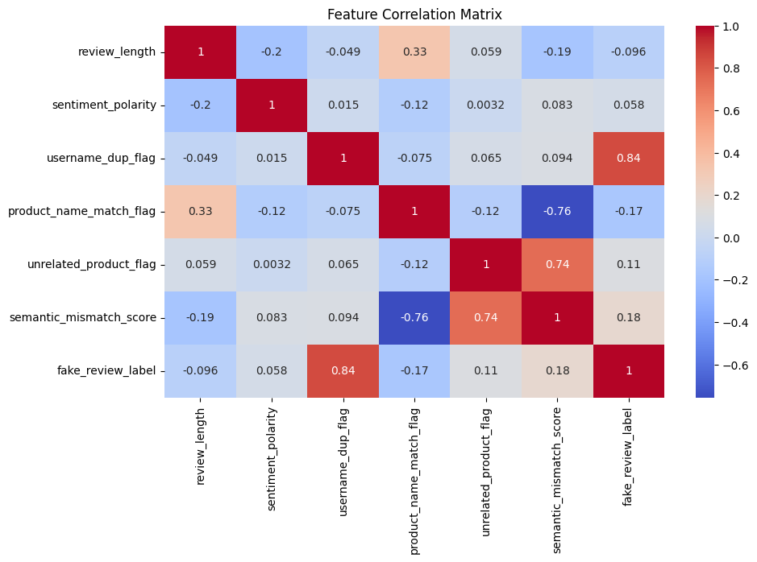
- 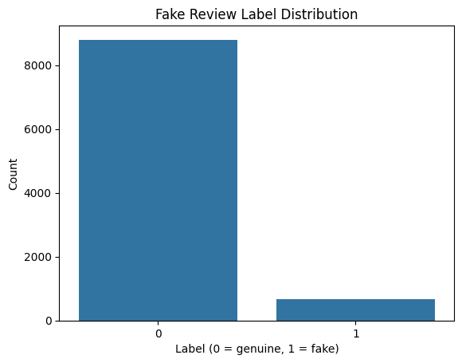

###  Feature Importance

- 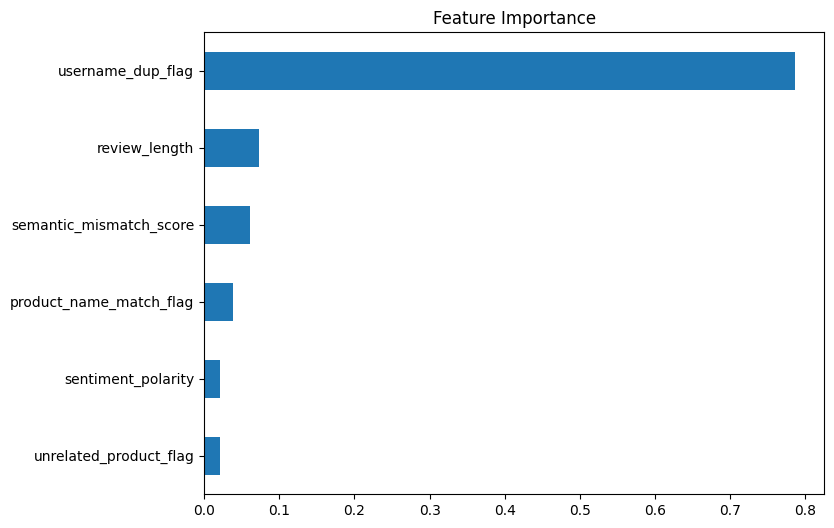

---

##  Budget Justification

| Task                          | Skill Area               | Budget Rationale |
|-------------------------------|--------------------------|------------------|
| Distribution analysis         | EDA                      | High — reveals skew, outliers, and signal strength |
| Correlation matrix            | Feature selection         | Medium — identifies redundancy and relationships |
| Label comparison via boxplots | Bias detection            | High — supports ethical modeling |
| Random Forest importance      | ML interpretability       | High — guides feature prioritization |
| Visualization                 | Data storytelling         | Medium — improves stakeholder communication |

---

