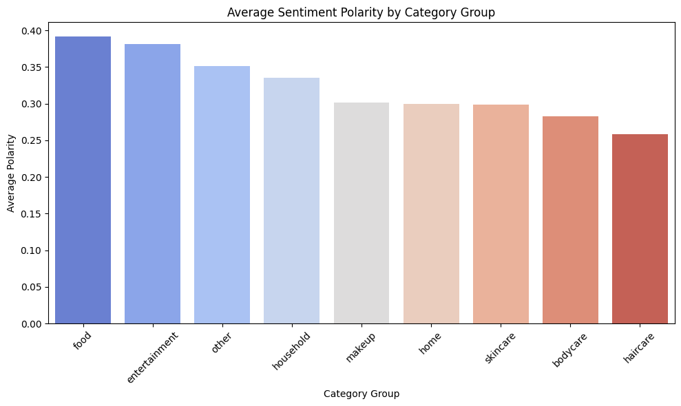

#  Sentiment Analysis by Product Category

[](https://github.com/cwattsnogueira/rating-predictor-spam-detection-review-summarizer)


<a href="https://colab.research.google.com/github/cwattsnogueira/rating-predictor-spam-detection-review-summarizer/blob/main/07_sentiment_by_category.ipynb" target="_parent">
  
</a>

---

##  Purpose

This notebook analyzes how customer sentiment varies across product categories using the `sentiment_polarity` feature. It helps uncover satisfaction trends, detect potential issues, and guide product strategy by visualizing sentiment distributions and averages per category group.

---

##  Folder Structure

```
├── 07-sentiment-by-category/
│   ├── notebook/     # Contains this sentiment analysis notebook
│   ├── output/       # Saved plots and summary table
│   └── README.md     # This documentation
```

---

##  Input File

| File Name                      | Description                                 | Link |
|-------------------------------|---------------------------------------------|------|
| `engineered_features.parquet` | Dataset with structured and sentiment features | [View file](../05-feature-engineering/output/engineered_features.parquet) |

---

##  Output File

| File Name                          | Description                                 | Link |
|-----------------------------------|---------------------------------------------|------|
| `sentiment_by_category_summary.csv` | Summary table with mean, std, and count per category group | [Download](./output/sentiment_by_category_summary.csv) |

---

##  Visual Outputs

All plots are saved in the `output/` folder and rendered below:

###  Sentiment Polarity by Category Group

Boxplot showing sentiment distribution across product categories.


---

###  Average Sentiment Polarity

Bar chart showing average sentiment polarity per category group.



---

###  Overall Sentiment Distribution

Histogram showing the overall distribution of sentiment polarity scores.


---

##  What the Code Does

- Loads the engineered dataset with sentiment scores and category labels
- Visualizes sentiment polarity distribution across category groups using boxplots
- Computes average sentiment per category and visualizes with bar charts
- Plots overall sentiment polarity histogram to assess skew and spread
- Exports a summary table with mean, standard deviation, and count per category group

---

##  Budget Justification

| Task                              | Skill Area               | Budget Rationale |
|-----------------------------------|--------------------------|------------------|
| Sentiment distribution analysis   | NLP + EDA                | High — reveals satisfaction trends |
| Category-level aggregation        | Business insight         | High — supports segmentation and strategy |
| Visualization                     | Data storytelling         | Medium — improves interpretability |
| Summary table export              | Workflow modularity       | Medium — supports reporting and reuse |

---

