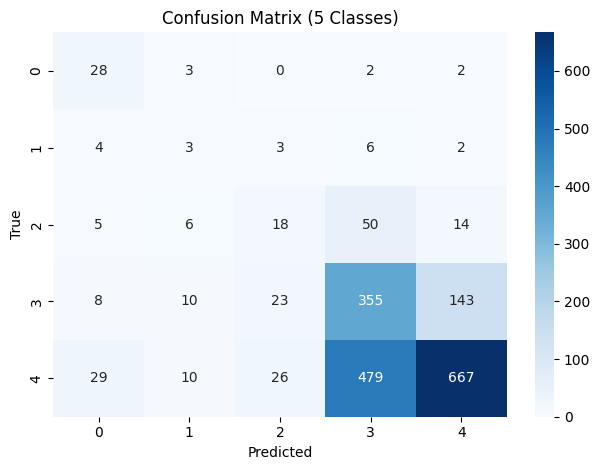
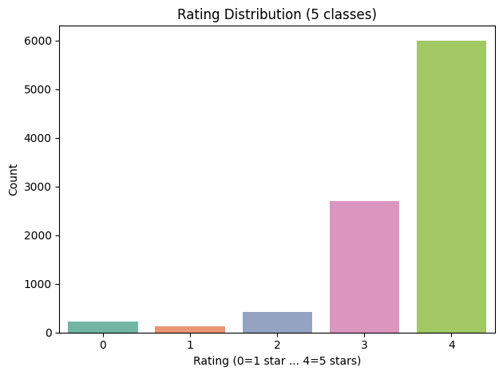

#  Fine-Tuning BERT for Multiclass Rating Prediction

[](https://github.com/cwattsnogueira/rating-predictor-spam-detection-review-summarizer)


<a href="https://colab.research.google.com/github/cwattsnogueira/rating-predictor-spam-detection-review-summarizer/blob/main/08_01_bert_5class_rating_model.ipynb" target="_parent">
  
</a>

---

##  Purpose

This notebook fine-tunes a pre-trained BERT model (`bert-base-uncased`) to predict product ratings from customer review text. The task is framed as a **multiclass classification problem** with five classes (1 to 5 stars), using PyTorch and Hugging Face Transformers. It handles class imbalance with weighted loss and applies early stopping to prevent overfitting.

---

##  Folder Structure

```
├── 08-01-multiclass-bert/
│   ├── notebook/     # Contains this BERT fine-tuning notebook
│   ├── output/       # Saved models, metrics, and plots
│   ├── output/bert_5class_rating_model/       # HF model
│   └── README.md     # This documentation
```

---

##  Input File

| File Name                      | Description                                 | Link |
|-------------------------------|---------------------------------------------|------|
| `engineered_features.parquet` | Dataset with cleaned review text and ratings | [View file](../../05-feature-engineering/output/engineered_features.parquet) |

---

##  Output Files

###  Model Checkpoints

| File Name                          | Description                                 | Link |
|-----------------------------------|---------------------------------------------|------|
| `best_multiclass_rating_model.pt` | Best model weights (saved via early stopping) | [Download](./output/best_multiclass_rating_model.pt) |
| `final_5class_rating_model.pt`    | Final model weights after full training     | [Download](./output/final_5class_rating_model.pt) |

###  Hugging Face Model Export (`bert_5class_rating_model/`)

| File Name                  | Description                                 | Link |
|---------------------------|---------------------------------------------|------|
| `config.json`             | Model configuration                         | [View file](./output/bert_5class_rating_model/config.json) |
| `model.safetensors`       | Serialized model weights                    | [View file](./output/bert_5class_rating_model/model.safetensors) |
| `special_tokens_map.json` | Token mapping for special tokens            | [View file](./output/bert_5class_rating_model/special_tokens_map.json) |
| `tokenizer_config.json`   | Tokenizer configuration                     | [View file](./output/bert_5class_rating_model/tokenizer_config.json) |
| `vocab.txt`               | Vocabulary used by tokenizer                | [View file](./output/bert_5class_rating_model/vocab.txt) |

###  Evaluation Artifacts

| File Name                          | Description                                 | Link |
|-----------------------------------|---------------------------------------------|------|
| `bert_5class_rating_metrics.pkl`  | Classification report, confusion matrix, class weights | [Download](./output/bert_5class_rating_metrics.pkl) |
| `confusion_matrix_5class.png`     | Confusion matrix plot                       |  |
| `rating_distribution_5class.png`  | Rating distribution plot                    |  |

---

##  What the Code Does

- Loads cleaned review text and original 1–5 star ratings
- Converts ratings to PyTorch-compatible labels (0–4)
- Computes class weights to address imbalance
- Tokenizes text using `bert-base-uncased`
- Splits data into train/test sets and formats for PyTorch
- Fine-tunes `BertForSequenceClassification` with:
  - Weighted `CrossEntropyLoss`
  - AdamW optimizer
  - Linear learning rate scheduler
  - Early stopping based on validation loss
- Evaluates model performance:
  - Accuracy per class
  - Confusion matrix
  - Macro F1 classification report
- Saves model weights and metrics for reuse and deployment

---

##  Evaluation Metrics

- **Macro F1 Score**: Handles class imbalance fairly
- **Per-Class Accuracy**: Shows performance for each rating level
- **Confusion Matrix**: Highlights misclassifications
- **Early Stopping**: Prevents overfitting

---

##  Budget Justification

| Task                              | Skill Area               | Budget Rationale |
|-----------------------------------|--------------------------|------------------|
| BERT fine-tuning                  | NLP + deep learning      | High — adapts semantic understanding to domain |
| Class imbalance handling          | Ethical modeling         | High — ensures fair representation |
| Tokenization + batching           | Workflow optimization    | Medium — supports scalable training |
| Evaluation + reporting            | Model interpretability   | High — enables transparent validation |
| Model export                      | Reusability              | Medium — supports deployment and sharing |

---

