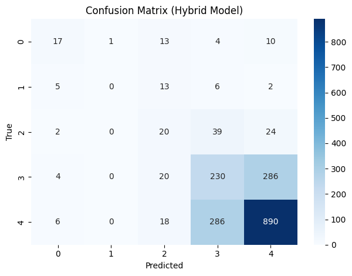

#  Hybrid BERT + Structured Features for Rating Prediction

[](https://github.com/cwattsnogueira/rating-predictor-spam-detection-review-summarizer)


<a href="https://colab.research.google.com/github/cwattsnogueira/rating-predictor-spam-detection-review-summarizer/blob/main/08_01_02_HybridRatingPredictionPipelineBERTEngineeredFeatures.ipynb" target="_parent">
  
</a>

---

##  Purpose

This notebook trains a **hybrid neural network** that combines BERT embeddings from review text with structured metadata features to predict product ratings (1 to 5 stars). It leverages semantic understanding and behavioral signals to improve classification accuracy.

---

##  Folder Structure

```
├── 08-01-hybrid-bert/
│   ├── notebook/     # Contains this hybrid model training notebook
│   ├── output/       # Saved models, metrics, and plots
│   └── README.md     # This documentation
```

---

##  Input File

| File Name                      | Description                                 | Link |
|-------------------------------|---------------------------------------------|------|
| `engineered_features.parquet` | Dataset with cleaned review text and structured features | [View file](../05-feature-engineering/output/engineered_features.parquet) |

---

##  Output Files

| File Name                          | Description                                 | Link |
|-----------------------------------|---------------------------------------------|------|
| `hybrid_rating_model.pt`          | Trained hybrid model weights                | [Download](./output/hybrid_rating_model.pt) |
| `structured_feature_scaler.pkl`   | Scaler used to normalize structured features | [Download](./output/structured_feature_scaler.pkl) |
| `hybrid_rating_metrics.pkl`       | Classification report and confusion matrix  | [Download](./output/hybrid_rating_metrics.pkl) |
| `hybrid_rating_model/`            | Saved tokenizer (BERT-based)                | [View folder](./output/hybrid_rating_model/) |

---

##  What the Code Does

- Loads review text and selected structured features
- Normalizes structured features using `StandardScaler`
- Tokenizes text using `bert-base-uncased`
- Defines a custom PyTorch `Dataset` combining both inputs
- Builds a hybrid neural network:
  - BERT encoder for text
  - Fully connected layers for fusion with structured features
- Trains the model using `CrossEntropyLoss` and `AdamW`
- Evaluates performance using:
  - Classification report
  - Confusion matrix
- Saves model weights, tokenizer, scaler, and metrics

---

##  Visual Outputs

All plots are saved in the `output/` folder and rendered below:

###  Confusion Matrix

- 

---

##  Structured Features Used

```python
[
  'review_length',
  'sentiment_polarity',
  'repetition_score',
  'semantic_mismatch_score',
  'product_name_match_flag',
  'unrelated_product_flag',
  'username_dup_flag'
]
```

These features capture linguistic, semantic, and behavioral signals beyond raw text.

---

##  Budget Justification

| Task                              | Skill Area               | Budget Rationale |
|-----------------------------------|--------------------------|------------------|
| BERT embedding extraction         | NLP + deep learning      | High — captures semantic nuance |
| Feature normalization             | Data preprocessing       | Medium — ensures scale compatibility |
| Hybrid model architecture         | Feature fusion            | High — enables multimodal learning |
| Evaluation + reporting            | Model interpretability   | High — supports transparent validation |
| Model export                      | Reusability              | Medium — supports deployment and sharing |

---
