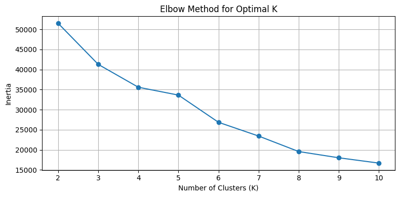
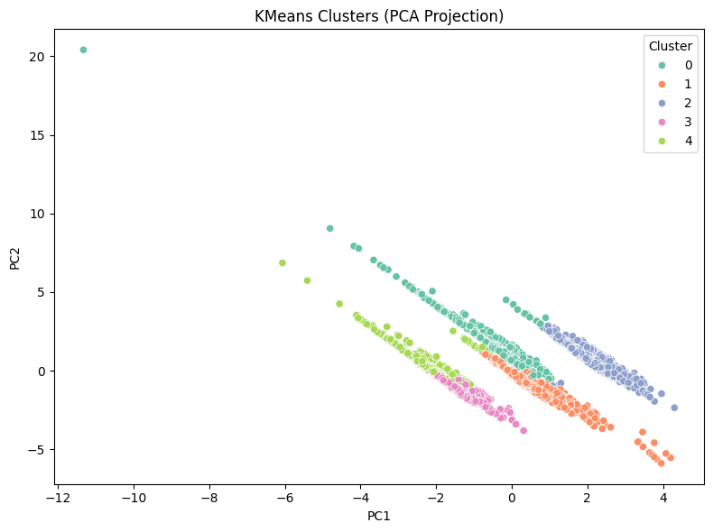

#  Unsupervised Clustering of Reviews with KMeans

[](https://github.com/cwattsnogueira/rating-predictor-spam-detection-review-summarizer)


<a href="https://colab.research.google.com/github/cwattsnogueira/rating-predictor-spam-detection-review-summarizer/blob/main/08_02_01_ClusteringPipeline_KMeans_ElbowMethod.ipynb" target="_parent">
  
</a>

---

##  Purpose

This notebook performs unsupervised clustering on product reviews using engineered features. It applies the **KMeans algorithm** to discover latent groupings and visualizes the clusters using **PCA**. This helps uncover behavioral or semantic patterns without relying on labeled data.

---

##  Folder Structure

```
├── 08-02-unsupervised-clustering/
│   ├── notebook/     # Contains this clustering notebook
│   ├── output/       # Saved clustered dataset and visualizations
│   └── README.md     # This documentation
```

---

##  Input File

| File Name                      | Description                                 | Link |
|-------------------------------|---------------------------------------------|------|
| `engineered_features.parquet` | Dataset with structured features for clustering | [View file](../../05-feature-engineering/output/engineered_features.parquet) |

---

##  Output File

| File Name                  | Description                                 | Link |
|---------------------------|---------------------------------------------|------|
| `review_clusters.parquet` | Dataset with assigned cluster labels        | [Download](./output/review_clusters.parquet) |

---

##  What the Code Does

- Loads engineered features from reviews
- Selects a subset of features for clustering (no labels used)
- Standardizes features using `StandardScaler`
- Applies the **Elbow Method** to determine optimal number of clusters
- Fits a `KMeans` model with the selected number of clusters
- Projects data into 2D space using `PCA` for visualization
- Assigns cluster labels to each review
- Saves the clustered dataset for downstream analysis

---

##  Features Used for Clustering

```python
[
  'review_length',
  'sentiment_polarity',
  'repetition_score',
  'semantic_mismatch_score',
  'product_name_match_flag',
  'unrelated_product_flag',
  'username_dup_flag'
]
```

These features capture linguistic, semantic, and behavioral signals that help differentiate review patterns.

---

##  Visual Outputs

All plots are saved in the `output/` folder and rendered below:

###  Elbow Method

Helps determine the optimal number of clusters by plotting inertia vs. K.



---

###  PCA Cluster Projection

Visualizes the KMeans clusters in 2D space using principal components.



---

##  Budget Justification

| Task                              | Skill Area               | Budget Rationale |
|-----------------------------------|--------------------------|------------------|
| Feature selection and scaling     | EDA + preprocessing      | Medium — ensures meaningful clustering |
| Elbow method                      | Model tuning             | Medium — supports optimal K selection |
| KMeans clustering                 | Unsupervised learning    | High — reveals latent structure |
| PCA visualization                 | Interpretability         | High — enables stakeholder insights |
| Cluster export                    | Reusability              | Medium — supports downstream modeling |

---

