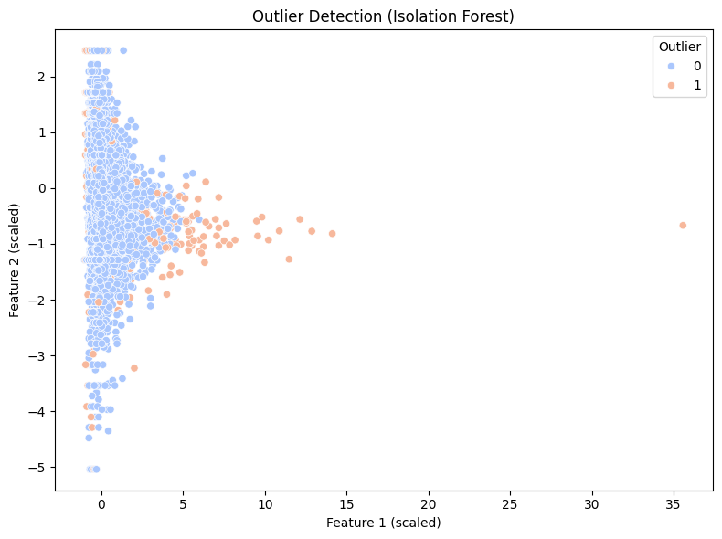

#  Outlier Detection in Reviews with Isolation Forest

[](https://github.com/cwattsnogueira/rating-predictor-spam-detection-review-summarizer)


<a href="https://colab.research.google.com/github/cwattsnogueira/rating-predictor-spam-detection-review-summarizer/blob/main/OutlierDetectionPipelinesolationForest.ipynb" target="_parent">
  
</a>

---

##  Purpose

This notebook applies **Isolation Forest** to detect anomalous reviews based on structured behavioral and semantic features. It flags reviews that deviate significantly from typical patterns, helping identify potential spam, manipulation, or edge cases.

---

##  Folder Structure

```
├── 08-02-outlier-detection/
│   ├── notebook/     # Contains this outlier detection notebook
│   ├── output/       # Saved flagged dataset and visualizations
│   └── README.md     # This documentation
```

---

##  Input File

| File Name                      | Description                                 | Link |
|-------------------------------|---------------------------------------------|------|
| `engineered_features.parquet` | Dataset with structured features for anomaly detection | [View file](../../05-feature-engineering/output/engineered_features.parquet) |

---

##  Output File

| File Name                  | Description                                 | Link |
|---------------------------|---------------------------------------------|------|
| `review_outliers.parquet` | Dataset with binary outlier flags (0 = normal, 1 = outlier) | [Download](./output/review_outliers.parquet) |

---

##  What the Code Does

- Loads engineered features from reviews
- Selects a subset of features for anomaly detection
- Standardizes features using `StandardScaler`
- Fits an `IsolationForest` model with 5% contamination
- Flags reviews as outliers (`outlier_flag = 1`) or normal (`outlier_flag = 0`)
- Visualizes outliers in 2D space using the first two scaled features
- Exports the flagged dataset for downstream filtering or analysis

---

##  Features Used for Detection

```python
[
  'review_length',
  'sentiment_polarity',
  'repetition_score',
  'semantic_mismatch_score',
  'product_name_match_flag',
  'unrelated_product_flag',
  'username_dup_flag'
]
```

These features capture linguistic, semantic, and behavioral signals that help isolate suspicious review patterns.

---

##  Visual Output

- 

---

##  Budget Justification

| Task                              | Skill Area               | Budget Rationale |
|-----------------------------------|--------------------------|------------------|
| Feature selection and scaling     | EDA + preprocessing      | Medium — ensures meaningful anomaly detection |
| Isolation Forest modeling         | Unsupervised learning    | High — robust to high-dimensional data |
| Outlier flagging                  | Integrity filtering      | High — supports ethical review analysis |
| Visualization                     | Interpretability         | Medium — enables stakeholder insights |
| Export for downstream use         | Reusability              | Medium — supports integration with other models |

---

