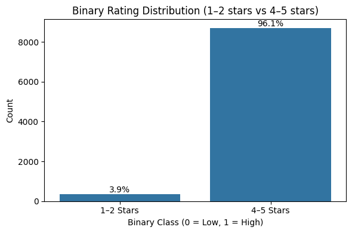
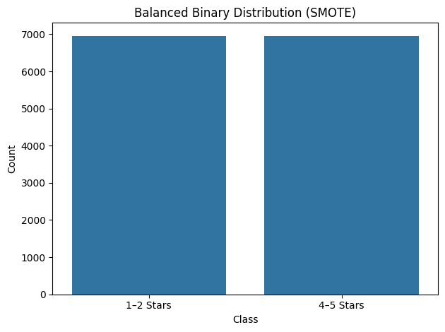
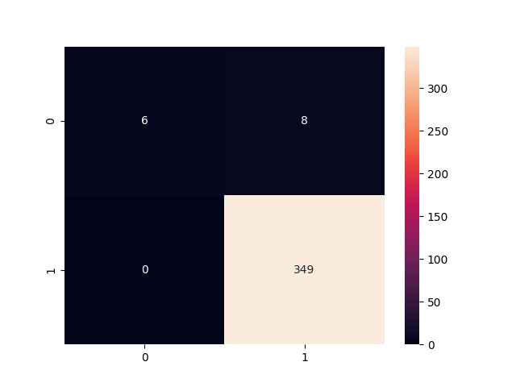
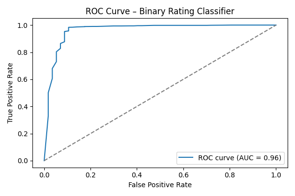
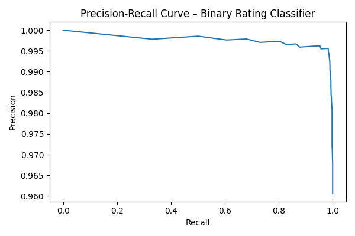
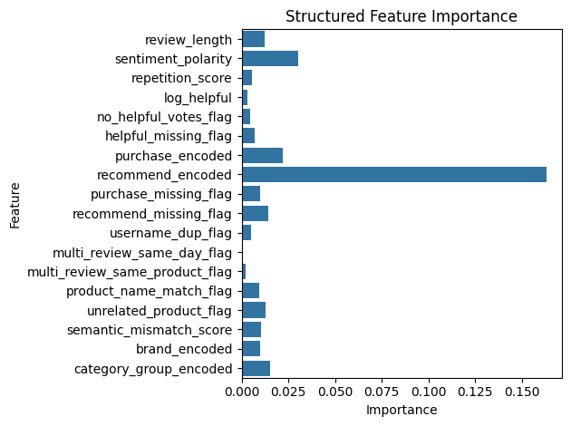
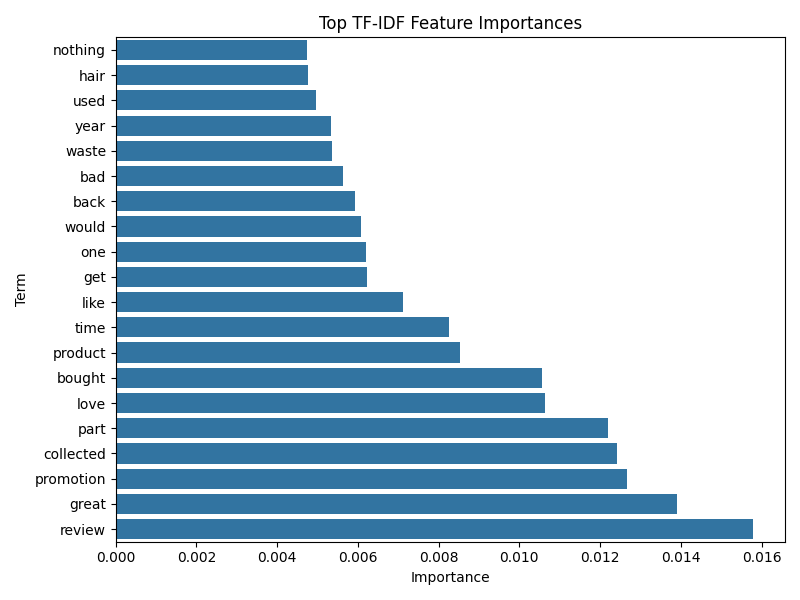
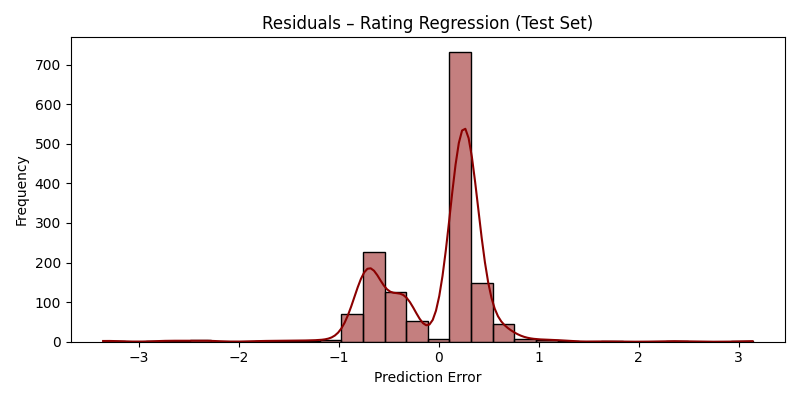
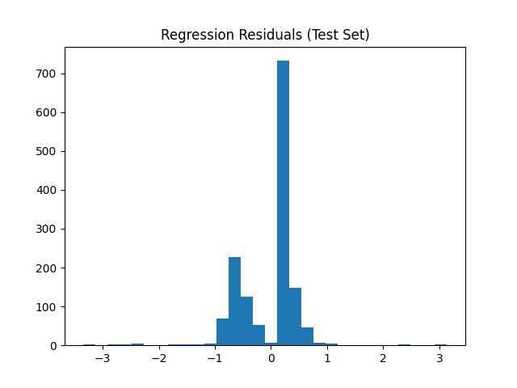
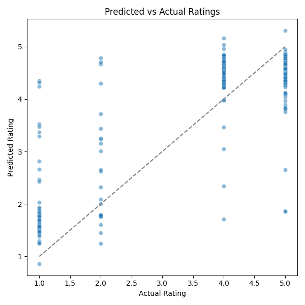

#  Rating Prediction from Reviews

[](https://github.com/cwattsnogueira/rating-predictor-spam-detection-review-summarizer)


<a href="https://colab.research.google.com/github/cwattsnogueira/rating-predictor-spam-detection-review-summarizer/blob/main/08_rating_prediction.ipynb" target="_parent">
  
</a>

---

##  Purpose

This notebook builds models to predict the rating a user gave to a product based on their review text and structured metadata. It includes:

- **Binary classification**: Predicting whether a review is low (1–2 stars) or high (4–5 stars)
- **Regression**: Predicting the exact rating (1–5) as a continuous value

Both approaches use TF-IDF vectors and engineered features to train and evaluate performance.

---

##  Folder Structure

```
├── 08-rating-prediction/
│   ├── notebook/     # Contains this rating prediction notebook
│   ├── output/       # Saved models, plots, and reports
│   └── README.md     # This documentation
```

---

##  Input Files

| File Name                      | Description                                 | Link |
|-------------------------------|---------------------------------------------|------|
| `engineered_features.parquet` | Dataset with structured features            | [View file](../05-feature-engineering/output/engineered_features.parquet) |
| `X_tfidf_vectorized.pkl`      | TF-IDF matrix from cleaned review text      | [View file](../04-text-cleaning-vectorization/output/X_tfidf_vectorized.pkl) |
| `tfidf_vectorizer.pkl`        | Trained TF-IDF vectorizer for feature names | [View file](../04-text-cleaning-vectorization/output/tfidf_vectorizer.pkl) |

---

##  Output Files

| File Name                          | Description                                 | Link |
|-----------------------------------|---------------------------------------------|------|
| `binary_rating_classifier_SMOTE.pkl` | Random Forest classifier (binary rating)   | [Download](./output/binary_rating_classifier_SMOTE.pkl) |
| `rating_prediction_regressor.pkl`   | Gradient Boosting regressor (exact rating) | [Download](./output/rating_prediction_regressor.pkl) |
| `classification_report_test.txt`   | Text report of classification metrics      | [Download](./output/classification_report_test.txt) |
| `structured_feature_importance.csv`| CSV with structured feature importances    | [Download](./output/structured_feature_importance.csv) |

---

##  What the Code Does

###  Binary Classification (1–2 stars vs 4–5 stars)

- Filters and encodes binary rating labels
- Combines TF-IDF and structured features
- Balances training data using SMOTE
- Trains a `RandomForestClassifier` with class weights
- Evaluates performance on test and validation sets:
  - Accuracy
  - Classification report
  - Confusion matrix
  - ROC-AUC
- Visualizes class distribution and feature importance

###  Regression (Exact Rating Prediction)

- Treats `reviews.rating` as a continuous variable
- Trains a `GradientBoostingRegressor`
- Evaluates using:
  - MAE (Mean Absolute Error)
  - RMSE (Root Mean Squared Error)
- Rounds predictions for classification-style evaluation
- Outputs confusion matrix and classification report

---

##  Visual Outputs

All plots are saved in the `output/` folder and rendered below:

###  Classification Plots

- 
- 
- 
- 
- 
- 
- 
- 

###  Regression Plots

- 
- 
- 

---

##  Budget Justification

| Task                              | Skill Area               | Budget Rationale |
|-----------------------------------|--------------------------|------------------|
| TF-IDF + metadata fusion          | NLP + feature engineering | High — captures semantic and behavioral signals |
| SMOTE balancing                   | Bias mitigation           | High — ensures fair training |
| Classification & regression       | ML modeling               | High — supports multiple use cases |
| Evaluation metrics                | Model interpretability    | High — enables ethical and transparent reporting |
| Feature importance visualization  | Data storytelling         | Medium — guides stakeholder decisions |

---

