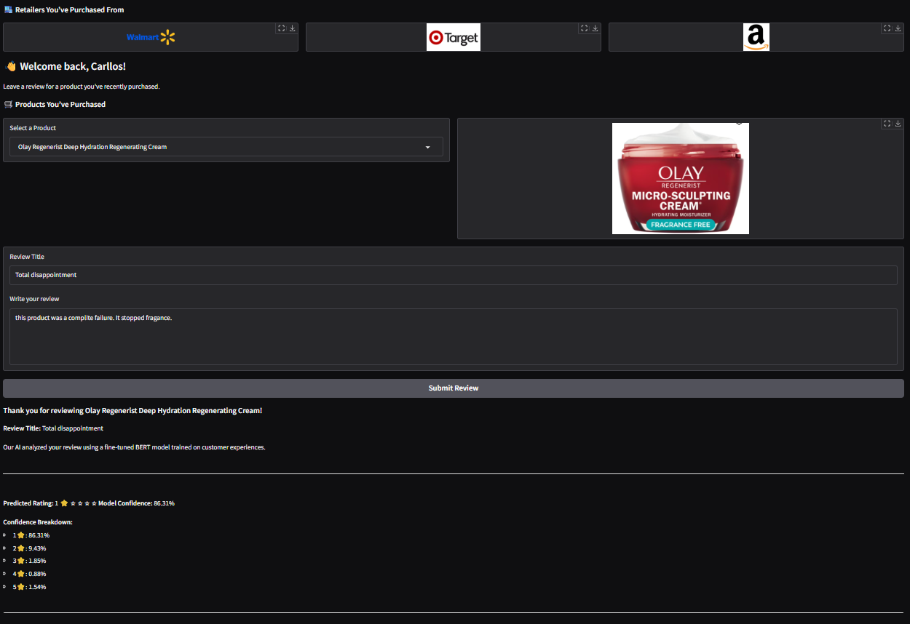
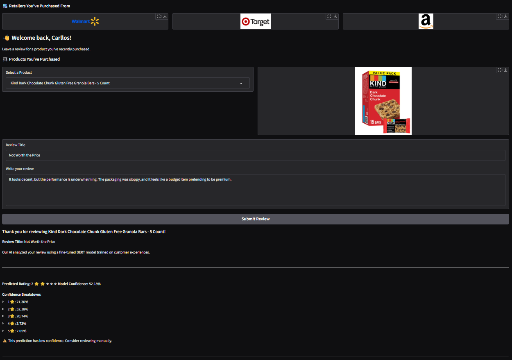
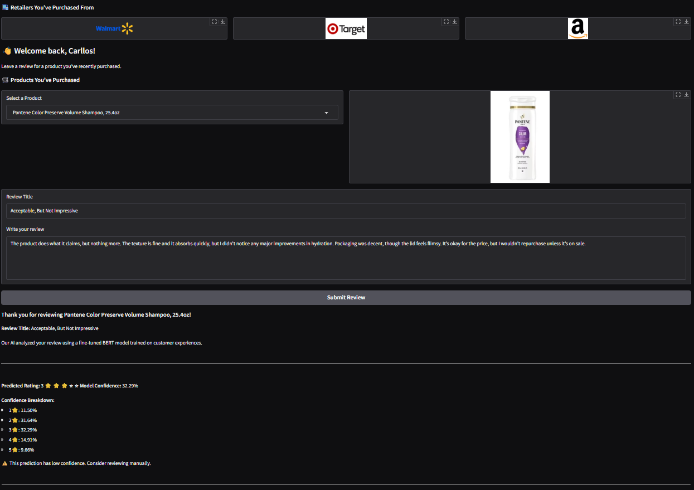
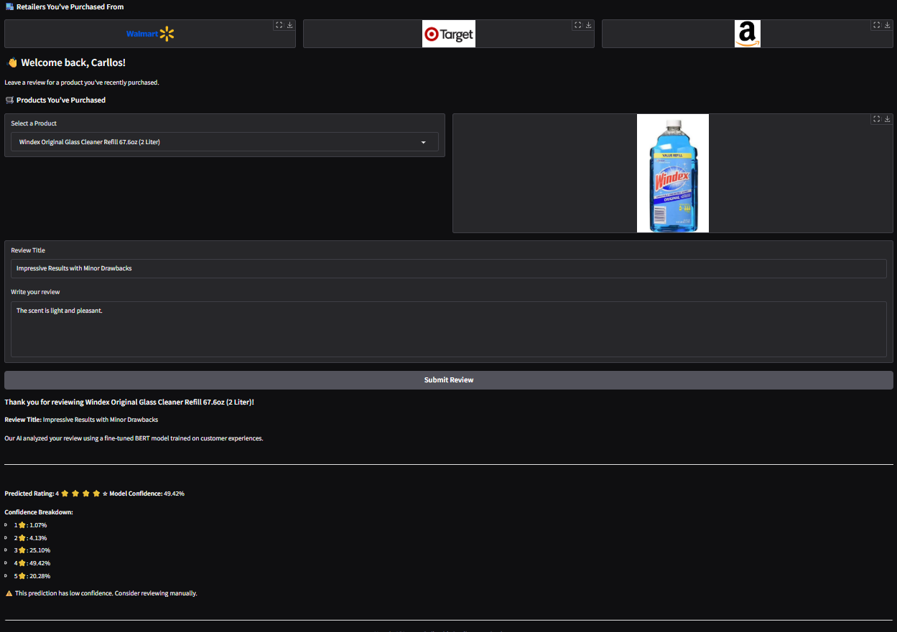
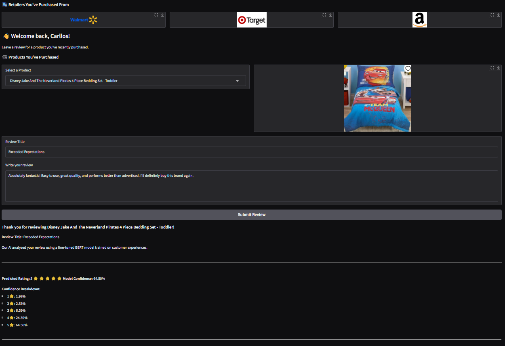

#  Retail Review Assistant (Gradio + BERT 5-Class Model)

[](https://github.com/cwattsnogueira/rating-predictor-spam-detection-review-summarizer)


<a href="https://colab.research.google.com/github/cwattsnogueira/rating-predictor-spam-detection-review-summarizer/blob/main/09_ReviewAssistantBERT5-ClassModel.ipynb" target="_parent">
  
</a>

---

##  Purpose

This notebook launches an interactive **Gradio app** that allows users to submit product reviews and receive a predicted star rating (1–5) using a fine-tuned BERT model. It combines NLP, visual feedback, and product-specific imagery to simulate a real-world retail review assistant.

---

##  Folder Structure

```
├── 09-retail-review-assistant/
│   ├── notebook/     # Contains this Gradio app notebook
│   ├── output/       # Uploaded model and image assets
│   └── README.md     # This documentation
```

---

##  Required Uploads

| File Name                      | Description                                 |
|-------------------------------|---------------------------------------------|
| `bert_5class_rating_model.zip`| Fine-tuned BERT model (Hugging Face format) |
| `imagens.zip`                 | Product and retailer image assets           |

After upload, both ZIP files are automatically extracted into `/content/`.

---

##  Output Files (after extraction)

###  Model Folder: `/content/bert_5class_rating_model/`

| File Name                  | Description                                 |
|---------------------------|---------------------------------------------|
| `config.json`             | Model configuration                         |
| `model.safetensors`       | Serialized model weights                    |
| `special_tokens_map.json` | Token mapping for special tokens            |
| `tokenizer_config.json`   | Tokenizer configuration                     |
| `vocab.txt`               | Vocabulary used by tokenizer                |

###  Image Folder: `/content/imagens/`

Includes product previews and retailer logos used in the UI.

---

##  What the Code Does

- Uploads and extracts model and image assets
- Loads fine-tuned BERT model for 5-class rating prediction
- Defines a prediction function that:
  - Combines title + review text
  - Tokenizes and feeds into BERT
  - Returns predicted rating, confidence, and emoji-based star rendering
- Builds a Gradio interface with:
  - Product dropdown and preview image
  - Review title and body input
  - Visual feedback and confidence breakdown
- Launches the app with `demo.launch(share=True)`

---

##  Gradio UI Features

-  Product selector with preview image
-  Review title and body input
-  Predicted star rating with emoji rendering
-  Confidence breakdown across all 5 classes
-  Warning if prediction confidence is low
-  Retailer logos (Walmart, Target, Amazon)

---

##  Budget Justification

| Task                              | Skill Area               | Budget Rationale |
|-----------------------------------|--------------------------|------------------|
| BERT fine-tuning integration      | NLP + deployment         | High — enables real-time prediction |
| Gradio interface design           | UX + interactivity       | High — improves user engagement |
| Confidence feedback               | Model transparency       | High — supports ethical AI usage |
| Image rendering                   | Visual storytelling      | Medium — enhances clarity and trust |
| ZIP upload + extraction           | Workflow setup           | Medium — enables flexible deployment |

---

Perfeito, Carllos! Aqui está o trecho atualizado para incluir as imagens de teste no seu `README.md` do notebook **Retail Review Assistant (Gradio + BERT 5-Class Model)**. Ele assume que você salvou as imagens de teste (como `1star.png`, `2star.png`, etc.) na pasta `output/`.

---

##  Test Examples by Predicted Rating

These screenshots show how the assistant responds to different review inputs, with predicted star ratings and visual feedback:

| Predicted Rating | Screenshot |
|------------------|------------|
| ⭐☆☆☆☆ (1 star)   |  |
| ⭐⭐☆☆☆ (2 stars)  |  |
| ⭐⭐⭐☆☆ (3 stars)  |  |
| ⭐⭐⭐⭐☆ (4 stars)  |  |
| ⭐⭐⭐⭐⭐ (5 stars)  |  |

Each prediction includes:

- Review title and body
- Emoji-based star rendering
- Confidence score and breakdown
- Warning if confidence is low

---

