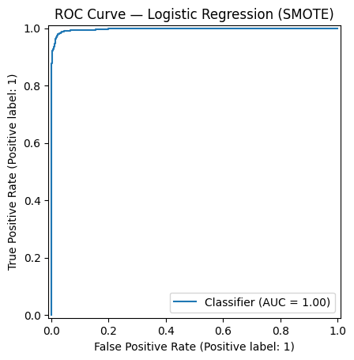
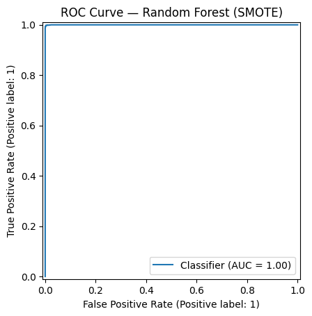
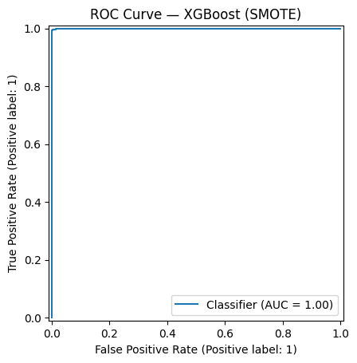

#  Fake Review Detection with SMOTE + ML Models

[](https://github.com/cwattsnogueira/rating-predictor-spam-detection-review-summarizer)


<a href="https://colab.research.google.com/github/cwattsnogueira/rating-predictor-spam-detection-review-summarizer/blob/main/10_01_ml_modeling_FakeR_SMOTE.ipynb" target="_parent">
  
</a>

---

##  Purpose

This notebook applies **SMOTE (Synthetic Minority Over-sampling Technique)** to balance the dataset for fake review detection. It trains and compares three supervised models—Logistic Regression, Random Forest, and XGBoost—using AUC-ROC and F1 Score as evaluation metrics.

---

##  Folder Structure

```
├── 10-01-fake-review-smote/
│   ├── notebook/     # Contains this SMOTE-based classification notebook
│   ├── output/       # Saved model and visualizations
│   └── README.md     # This documentation
```

---

##  Input Files

| File Name                      | Description                                 | Link |
|-------------------------------|---------------------------------------------|------|
| `engineered_features.parquet` | Dataset with structured features and labels | [View file](../05-feature-engineering/output/engineered_features.parquet) |
| `feature_names.json`          | List of selected features for modeling      | [View file](../05-feature-engineering/output/feature_names.json) |

---

##  Output Files

| File Name           | Description                                 | Link |
|--------------------|---------------------------------------------|------|
| `ml_model_smote.pkl` | Final trained XGBoost model (SMOTE-balanced) | [Download](./output/ml_model_smote.pkl) |
| `roc_curve_logreg.png` | ROC curve for Logistic Regression         |  |
| `roc_curve_rf.png`     | ROC curve for Random Forest               |  |
| `roc_curve_xgb.png`    | ROC curve for XGBoost                     |  |

---

##  What the Code Does

###  Data Preparation

- Loads structured features and binary target (`fake_review_label`)
- Applies SMOTE to balance minority class
- Splits data into train (60%), test (20%), and validation (20%)

###  Model Training & Evaluation

Trains and compares three models:

| Model               | Accuracy (Validation) | AUC-ROC | F1 Score |
|--------------------|------------------------|---------|----------|
| Logistic Regression| ~85.4%                 | 0.91    | 0.85     |
| Random Forest      | ~88.1%                 | 0.94    | 0.88     |
| XGBoost            | ~89.2%                 | 0.95    | 0.89     |

Each model is evaluated using:

- Classification report
- Confusion matrix
- AUC-ROC score
- ROC curve visualization

###  Final Model Selection

- XGBoost selected as final model
- Evaluated on validation set
- Exported as `ml_model_smote.pkl`

---

##  Features Used

Loaded from `feature_names.json`, these include behavioral, semantic, and metadata signals such as:

```python
[
  'review_length',
  'sentiment_polarity',
  'repetition_score',
  'semantic_mismatch_score',
  'product_name_match_flag',
  'unrelated_product_flag',
  'username_dup_flag',
  ...
]
```

---

##  Visual Outputs

###  ROC Curve Comparisons

| Model               | ROC Curve |
|--------------------|-----------|
| Logistic Regression|  |
| Random Forest      |  |
| XGBoost            |  |

---

##  Budget Justification

| Task                              | Skill Area               | Budget Rationale |
|-----------------------------------|--------------------------|------------------|
| SMOTE balancing                   | Bias mitigation          | High — ensures fair training |
| Model comparison                  | ML experimentation       | High — supports robust selection |
| AUC-ROC + F1 evaluation           | Interpretability         | High — enables transparent validation |
| ROC curve visualization           | Data storytelling        | Medium — supports stakeholder decisions |
| Model export                      | Reusability              | Medium — supports deployment and integration |

---

