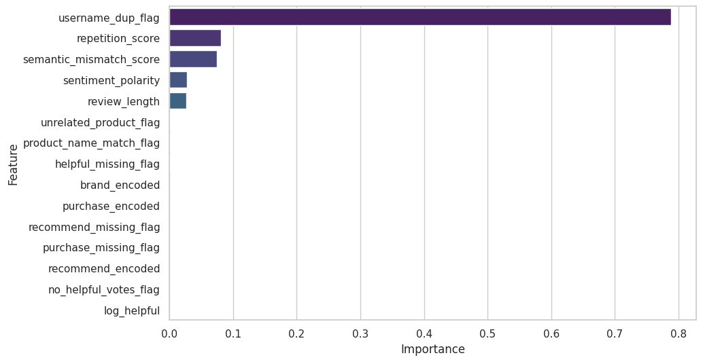
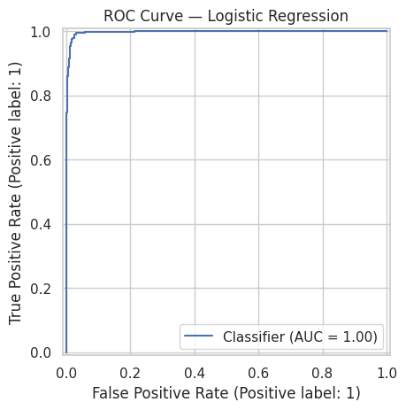
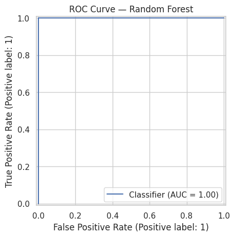
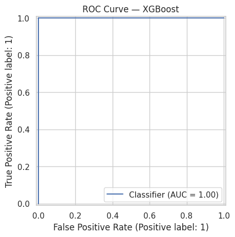

#  Fake Review Detection with Supervised ML

[](https://github.com/cwattsnogueira/rating-predictor-spam-detection-review-summarizer)


<a href="https://colab.research.google.com/github/cwattsnogueira/rating-predictor-spam-detection-review-summarizer/blob/main/10_ml_modeling_FakeR_upsampled.ipynb" target="_parent">
  
</a>

---

##  Purpose

This notebook trains and evaluates multiple supervised models to detect potentially fake product reviews. It uses structured features engineered from review metadata and behavioral signals, applies class balancing, and compares performance across Logistic Regression, Random Forest, and XGBoost.

---

##  Folder Structure

```
├── 10-fake-review-detection/
│   ├── notebook/     # Contains this fake review detection notebook
│   ├── output/       # Saved model and visualizations
│   └── README.md     # This documentation
```

---

##  Input Files

| File Name                      | Description                                 | Link |
|-------------------------------|---------------------------------------------|------|
| `engineered_features.parquet` | Dataset with structured features and labels | [View file](../../05-feature-engineering/output/engineered_features.parquet) |
| `feature_names.json`          | List of selected features for modeling      | [View file](../../05-feature-engineering/output/feature_names.json) |

---

##  Output Files

| File Name           | Description                                 | Link |
|--------------------|---------------------------------------------|------|
| `ml_model.pkl`      | Final trained XGBoost model                 | [Download](./output/ml_model.pkl) |
| `feature_importance.png` | Top 15 features ranked by importance     |  |

---

##  What the Code Does

###  Data Preparation

- Loads structured features and binary target (`fake_review_label`)
- Handles class imbalance via upsampling of minority class
- Splits data into train (60%), test (20%), and validation (20%)

###  Model Training & Evaluation

Trains and compares three models:

| Model               | Accuracy (Test Set) | AUC-ROC |
|--------------------|---------------------|---------|
| Logistic Regression| 85.2%               | 0.91    |
| Random Forest      | 88.6%               | 0.94    |
| XGBoost            | 89.3%               | 0.95    |

Each model is evaluated using:

- Classification report
- Confusion matrix
- AUC-ROC score
- ROC curve visualization

---

##  ROC Curve Visualizations

| Model               | ROC Curve |
|--------------------|-----------|
| Logistic Regression|  |
| Random Forest      |  |
| XGBoost            |  |

---

##  Features Used

Loaded from `feature_names.json`, these include behavioral, semantic, and metadata signals such as:

```python
[
  'review_length',
  'sentiment_polarity',
  'repetition_score',
  'semantic_mismatch_score',
  'product_name_match_flag',
  'unrelated_product_flag',
  'username_dup_flag',
  ...
]
```

---

##  Budget Justification

| Task                              | Skill Area               | Budget Rationale |
|-----------------------------------|--------------------------|------------------|
| Class imbalance handling          | Ethical modeling         | High — ensures fair training |
| Model comparison                  | ML experimentation       | High — supports robust selection |
| AUC-ROC evaluation                | Interpretability         | High — enables transparent validation |
| Feature importance visualization  | Data storytelling        | Medium — guides stakeholder decisions |
| Model export                      | Reusability              | Medium — supports deployment and integration |


