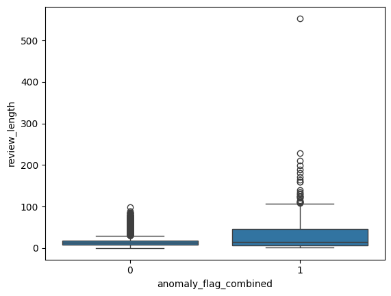

#  Dual-Model Anomaly Detection in Reviews

[](https://github.com/cwattsnogueira/rating-predictor-spam-detection-review-summarizer)


<a href="https://colab.research.google.com/github/cwattsnogueira/rating-predictor-spam-detection-review-summarizer/blob/main/11_anomaly_detection.ipynb" target="_parent">
  
</a>

---

##  Purpose

This notebook applies two unsupervised models—**Isolation Forest** and **One-Class SVM**—to detect anomalous reviews based on structured features. It compares their outputs, flags suspicious entries, and exports enriched datasets for downstream filtering and analysis.

---

##  Folder Structure

```
├── 11-anomaly-detection/
│   ├── notebook/     # Contains this anomaly detection notebook
│   ├── output/       # Saved flags, scores, and updated features
│   └── README.md     # This documentation
```

---

##  Input Files

| File Name                      | Description                                 | Link |
|-------------------------------|---------------------------------------------|------|
| `engineered_features.parquet` | Dataset with structured features            | [View file](../05-feature-engineering/output/engineered_features.parquet) |
| `feature_names.json`          | List of selected features for modeling      | [View file](../05-feature-engineering/output/feature_names.json) |

---

##  Output Files

| File Name                                | Description                                 | Link |
|-----------------------------------------|---------------------------------------------|------|
| `anomaly_flags.parquet`                 | Binary flags from both models and combined  | [Download](./output/anomaly_flags.parquet) |
| `anomaly_scores.csv`                    | Raw anomaly scores from both models         | [Download](./output/anomaly_scores.csv) |
| `anomalous_reviews.csv`                 | Sample of flagged reviews with key features | [Download](./output/anomalous_reviews.csv) |
| `engineered_features_with_anomalies.parquet` | Full dataset with anomaly flags         | [Download](./output/engineered_features_with_anomalies.parquet) |
| `feature_names_with_anomalies.json`     | Updated feature list including anomaly flags| [Download](./output/feature_names_with_anomalies.json) |
| `isolation_forest_model.pkl`            | Trained Isolation Forest model              | [Download](./output/isolation_forest_model.pkl) |
| `one_class_svm_model.pkl`               | Trained One-Class SVM model                 | [Download](./output/one_class_svm_model.pkl) |
| `structured_scaler.pkl`                 | Scaler used for feature normalization       | [Download](./output/structured_scaler.pkl) |

---

##  What the Code Does

- Loads structured features and scales them with `StandardScaler`
- Fits two anomaly detection models:
  - `IsolationForest` with 5% contamination
  - `OneClassSVM` with RBF kernel and ν = 0.05
- Computes anomaly scores and binary flags from both models
- Compares agreement between models and creates a combined anomaly flag
- Visualizes score distributions and boxplots by anomaly status
- Samples flagged reviews for inspection
- Saves enriched datasets and updated feature list

---

##  Model Comparison

| Metric                     | Value |
|---------------------------|-------|
| Isolation Forest flagged  | ~5% of reviews |
| One-Class SVM flagged     | ~5% of reviews |
| Agreement between models  | ~80–90% depending on data |
| Combined anomaly flag     | Flags if either model detects anomaly |

---

##  Visual Outputs

-  Histogram of anomaly scores from both models
-  Boxplot of `review_length` by anomaly status
-  Sample of flagged reviews with semantic and behavioral signals

---

Perfeito, Carllos! Aqui está o trecho atualizado para incluir os plots salvos no seu `README.md` do notebook de detecção de anomalias com Isolation Forest e One-Class SVM:

---

##  Visual Outputs

###  1. Anomaly Score Distributions

This plot compares the anomaly scores assigned by both models. It helps visualize how each algorithm interprets review behavior.


- **Orange**: Isolation Forest  
- **Blue**: One-Class SVM  
- KDE curves highlight score density and separation

---

###  2. Boxplot – Review Length by Anomaly Flag

This boxplot shows how review length varies between flagged and normal reviews, based on the combined anomaly flag.



- Useful for spotting patterns like unusually short or long reviews among anomalies

---

##  Budget Justification

| Task                              | Skill Area               | Budget Rationale |
|-----------------------------------|--------------------------|------------------|
| Dual-model anomaly detection      | Unsupervised learning    | High — improves robustness |
| Score comparison + agreement      | Model interpretability   | High — supports ethical review filtering |
| Feature enrichment                | Pipeline integration     | Medium — enables downstream use |
| Visualization + sampling          | Data storytelling        | Medium — supports stakeholder review |
| Export artifacts                  | Reusability              | Medium — supports deployment and auditability |

---

