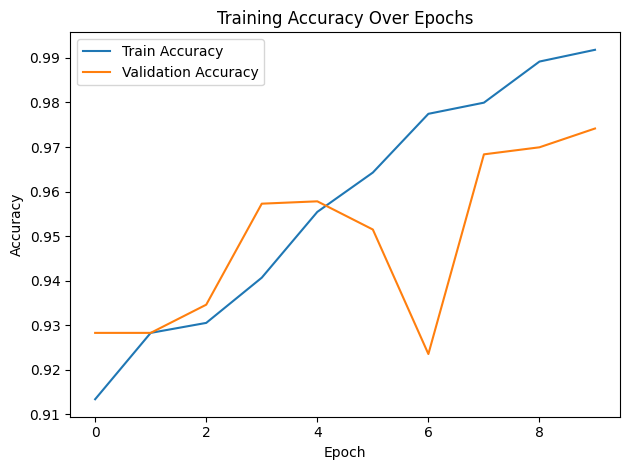
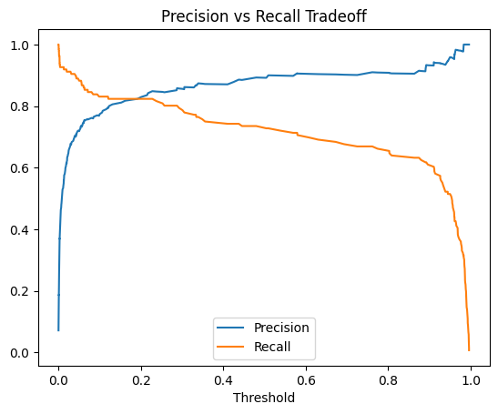
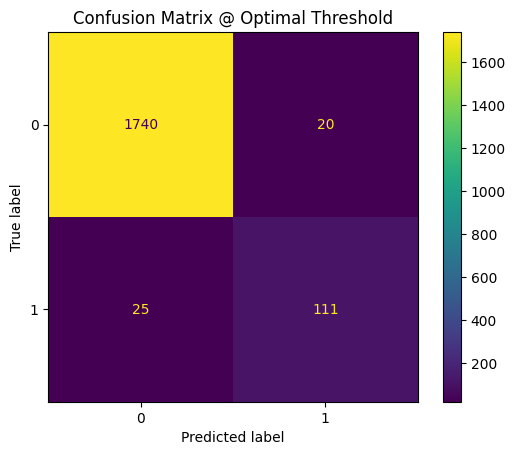

#  Fake Review Classification with LSTM + Structured Features

[](https://github.com/cwattsnogueira/rating-predictor-spam-detection-review-summarizer)


<a href="https://colab.research.google.com/github/cwattsnogueira/rating-predictor-spam-detection-review-summarizer/blob/main/12_dl_modeling.ipynb" target="_parent">
  
</a>

---

##  Purpose

This notebook trains a hybrid neural network using **LSTM layers** for text input and structured features to classify fake reviews. It includes threshold tuning, precision-recall analysis, and model export for deployment.

---

##  Folder Structure

```
├── 12-lstm-review-classifier/
│   ├── notebook/     # Contains this LSTM classification notebook
│   ├── output/       # Saved model, tokenizer, plots, and metadata
│   └── README.md     # This documentation
```

---

##  Input Files

| File Name                                | Description                                 | Link |
|-----------------------------------------|---------------------------------------------|------|
| `engineered_features_with_anomalies.parquet` | Dataset with structured features and anomaly flags | [View file](../11-anomaly-detection/output/engineered_features_with_anomalies.parquet) |
| `feature_names_with_anomalies.json`     | List of selected features for modeling      | [View file](../11-anomaly-detection/output/feature_names_with_anomalies.json) |

---

##  Output Files

| File Name                  | Description                                 | Link |
|---------------------------|---------------------------------------------|------|
| `rnn_model.keras`         | Final trained LSTM model                    | [Download](./output/rnn_model.keras) |
| `tokenizer.pkl`           | Tokenizer used for text preprocessing       | [Download](./output/tokenizer.pkl) |
| `decision_threshold.txt`  | Optimal threshold for classification        | [Download](./output/decision_threshold.txt) |
| `training_log_v1.csv`     | Training log with accuracy and loss         | [Download](./output/training_log_v1.csv) |
| `model_metadata.json`     | Metadata for model deployment               | [Download](./output/model_metadata.json) |
| `y_pred_custom.npy`       | Final predictions using tuned threshold     | [Download](./output/y_pred_custom.npy) |

---

##  What the Code Does

- Loads cleaned review text and structured features
- Tokenizes and pads text using `Tokenizer` and `pad_sequences`
- Combines text and structured inputs into a unified feature matrix
- Builds an LSTM-based neural network with dropout and dense layers
- Trains the model with early stopping and logs metrics
- Evaluates performance using:
  - Classification report
  - Precision-recall curve
  - Threshold tuning for optimal F1 score
  - Confusion matrix
- Saves model, tokenizer, threshold, and metadata for reuse

---

##  Visual Outputs

###  1. Training Accuracy Over Epochs

Shows how accuracy evolves during training and validation.



---

###  2. Precision vs Recall Tradeoff

Helps identify the optimal threshold for classification.



---

###  3. Confusion Matrix @ Optimal Threshold

Displays true vs predicted labels after threshold tuning.



---

##  Budget Justification

| Task                              | Skill Area               | Budget Rationale |
|-----------------------------------|--------------------------|------------------|
| LSTM modeling                     | NLP + deep learning      | High — captures semantic nuance |
| Feature fusion                    | Hybrid architecture      | High — combines behavioral and textual signals |
| Threshold tuning                  | Ethical modeling         | High — improves fairness and precision |
| Visualization                     | Interpretability         | Medium — supports stakeholder review |
| Model export                      | Reusability              | Medium — enables deployment and integration |

---

