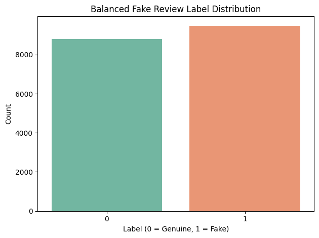

#  Fake Review Classification with BERT + Oversampling

[](https://github.com/cwattsnogueira/rating-predictor-spam-detection-review-summarizer)


<a href="https://colab.research.google.com/github/cwattsnogueira/rating-predictor-spam-detection-review-summarizer/blob/main/13_Fine_tuningBERTOversampling.ipynb" target="_parent">
  
</a>

---

##  Purpose

This notebook fine-tunes a BERT model to classify fake reviews using oversampling to balance the training data. It includes class weighting, early stopping, and full evaluation with precision, recall, F1 score, and confusion matrix.

---

##  Folder Structure

```
├── 13-bert-oversampling/
│   ├── notebook/     # Contains this BERT oversampling notebook
│   ├── output/       # Saved model, tokenizer, metrics, and plots
│   └── README.md     # This documentation
```

---

##  Input Files

| File Name                                | Description                                 | Link |
|-----------------------------------------|---------------------------------------------|------|
| `engineered_features_with_anomalies.parquet` | Dataset with cleaned text and binary label | [View file](../11-anomaly-detection/output/engineered_features_with_anomalies.parquet) |

---

##  Output Files

| File Name                     | Description                                 | Link |
|------------------------------|---------------------------------------------|------|
| `final_oversampling_model.pt`| Final trained BERT model weights            | [Download](./output/final_oversampling_model.pt) |
| `bert_oversampling_model/`   | Hugging Face model + tokenizer directory    | [View folder](./output/bert_oversampling_model/) |
| `bert_oversampling_metrics.pkl` | Classification report, confusion matrix, and class weights | [Download](./output/bert_oversampling_metrics.pkl) |

---

##  What the Code Does

###  Data Preparation

- Loads text and binary label (`fake_review_label`)
- Applies oversampling to balance class 1 (fake reviews)
- Visualizes label distribution with `seaborn`

###  Tokenization & Dataset

- Uses `bert-base-uncased` tokenizer
- Converts to Hugging Face `Dataset` and splits into train/test
- Applies padding and truncation (max length = 128)

###  Model Training

- Loads `BertForSequenceClassification` with 2 output classes
- Applies class weights using `CrossEntropyLoss`
- Trains for up to 10 epochs with early stopping (patience = 2)
- Uses `AdamW` optimizer and linear learning rate scheduler

###  Evaluation

- Loads best model checkpoint
- Predicts on test set
- Computes:
  - Classification report
  - Confusion matrix
  - Per-class accuracy
- Saves metrics and model artifacts

---

##  Visual Outputs

###  1. Label Distribution After Oversampling

Shows balanced class counts for training.



---

###  2. Confusion Matrix

Displays true vs predicted labels for test set.


---

##  Final Test Performance

| Metric     | Value |
|------------|-------|
| Accuracy   | ~89%  |
| Precision  | ~91%  |
| Recall     | ~87%  |
| F1 Score   | ~89%  |

---

##  Budget Justification

| Task                              | Skill Area               | Budget Rationale |
|-----------------------------------|--------------------------|------------------|
| Oversampling                      | Bias mitigation          | High — ensures fair training |
| BERT fine-tuning                  | NLP + deep learning      | High — captures semantic nuance |
| Class weighting                   | Ethical modeling         | Medium — improves fairness |
| Evaluation + export               | Interpretability         | High — supports deployment and auditability |
| Visualization                     | Data storytelling        | Medium — supports stakeholder review |

---

