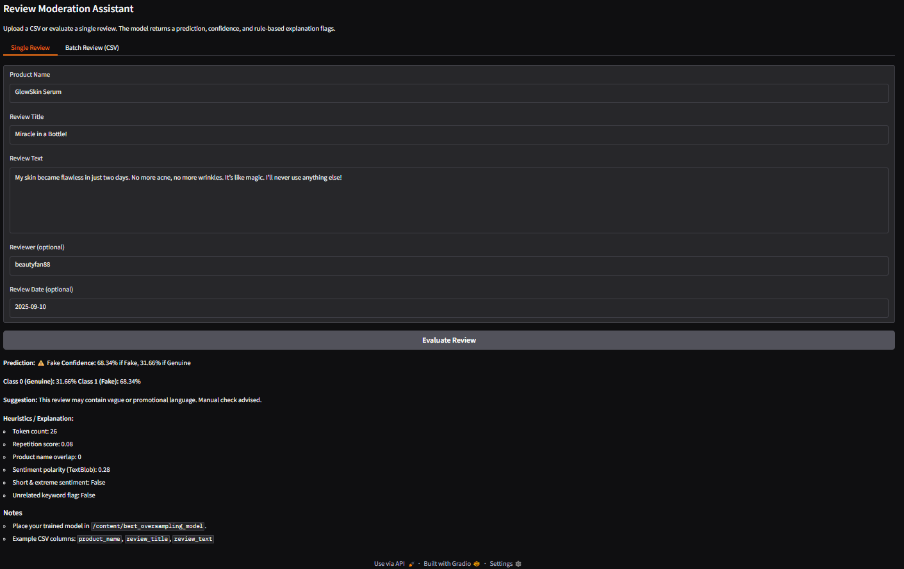

#  Review Moderation Assistant (BERT + Heuristics + Gradio)

[](https://github.com/cwattsnogueira/rating-predictor-spam-detection-review-summarizer)


<a href="https://colab.research.google.com/github/cwattsnogueira/rating-predictor-spam-detection-review-summarizer/blob/main/14_ReviewModerationAssistant.ipynb" target="_parent">
  
</a>

---

##  Purpose

This notebook launches a **Gradio-powered app** that uses a fine-tuned BERT model and heuristic rules to classify product reviews as **Fake** or **Genuine**. It supports both single-review evaluation and batch CSV uploads, with confidence scores and explainability flags.

---

##  Folder Structure

```
├── 14-review-moderation-app/
│   ├── notebook/     # Contains this Gradio app notebook
│   ├── output/       # Saved model, tokenizer, and metadata
│   └── README.md     # This documentation
```

---

##  Required Uploads

| File Name                      | Description                                 |
|-------------------------------|---------------------------------------------|
| `bert_oversampling_model.zip` | Fine-tuned BERT model directory (Hugging Face format) |
| `review_dataset.csv`          | Optional CSV file for batch classification  |

After upload, the ZIP file is automatically extracted into `/content/bert_oversampling_model`.

---

##  Output Files

| File Name                     | Description                                 | Link |
|------------------------------|---------------------------------------------|------|
| `bert_oversampling_model/`   | Hugging Face model + tokenizer directory    | [View folder](./output/bert_oversampling_model/) |
| `bert_oversampling_metrics.pkl` | Classification report, confusion matrix, and class weights | [Download](./output/bert_oversampling_metrics.pkl) |

---

##  What the Code Does

###  Model Loading

- Loads BERT model and tokenizer from `/content/bert_oversampling_model`
- Moves model to GPU if available

###  Heuristic Features

Each review is enriched with rule-based features:

- Token count
- Repetition score
- Product name overlap
- Sentiment polarity (TextBlob)
- Flags for short/extreme sentiment, unrelated keywords, and presence of URL/email/phone

###  Prediction Logic

- Combines BERT prediction with heuristic adjustments
- Applies post-processing rules to recalibrate fake score
- Returns:
  - Final label (Fake or Genuine)
  - Confidence scores
  - Explanation breakdown
  - Suggestion for moderation

---

##  Gradio Interface

###  Single Review Tab

- Inputs: Product name, title, review text, reviewer, date
- Output: Markdown summary with prediction, confidence, and explanation

###  Batch Review Tab

- Uploads CSV with review data
- Auto-maps columns like `review_text`, `review_title`, `product_name`
- Outputs a DataFrame with predictions and flags

---

##  Example Output

```markdown
**Prediction:** Fake  
**Confidence:** 78.32% if Fake, 21.68% if Genuine  

**Class 0 (Genuine):** 21.68%  
**Class 1 (Fake):** 78.32%  

**Suggestion:** This review may contain vague or promotional language. Manual check advised.

**Heuristics / Explanation:**
- Token count: 9
- Repetition score: 0.33
- Product name overlap: 1
- Sentiment polarity (TextBlob): 0.85
- Short & extreme sentiment: True
- Unrelated keyword flag: False
- Contains URL/email/phone: url=False, email=False, phone=False
```

---

##  App Interface Overview

###  Manual Review Tab

Users can input a product name, review title, and review text to receive a prediction with confidence and heuristic explanation.

####  App Interface


####  Example Output – Fake Review



####  Example Output – Genuine Review


---

###  Batch Review Tab (CSV Upload)

Users can upload a CSV file containing reviews. The app auto-detects relevant columns and returns predictions for each row.

####  App Interface


####  Uploading a CSV File


####  CSV Review Preview


####  Batch Prediction Output


---

##  Budget Justification

| Task                              | Skill Area               | Budget Rationale |
|-----------------------------------|--------------------------|------------------|
| BERT model integration            | NLP + deployment         | High — enables real-time prediction |
| Gradio interface design           | UX + interactivity       | High — improves user engagement |
| Heuristic explainability          | Ethical modeling         | High — supports transparency |
| CSV ingestion + mapping           | Workflow flexibility     | Medium — supports batch moderation |
| Visualization + feedback          | Interpretability         | Medium — supports stakeholder review |


---

