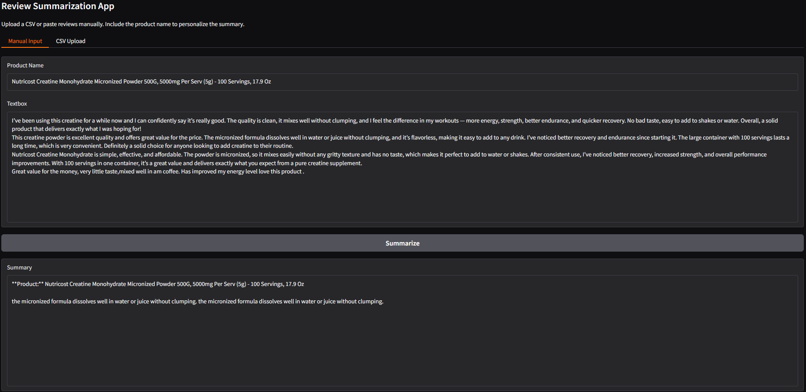
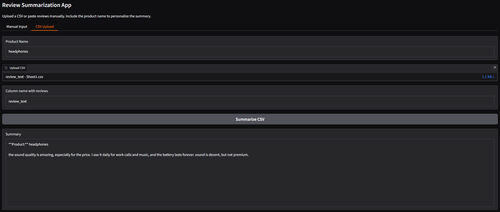

#  Review Summarization App (T5 + Gradio)

[](https://github.com/cwattsnogueira/rating-predictor-spam-detection-review-summarizer)


<a href="https://colab.research.google.com/github/cwattsnogueira/rating-predictor-spam-detection-review-summarizer/blob/main/15_01_review_summarization_appt5_small.ipynb" target="_parent">
  
</a>

---

##  Purpose

This notebook launches a **Gradio app** that uses the **T5-small** model to generate concise summaries of product reviews. It supports both manual text input and CSV uploads, allowing users to personalize summaries with product names.

---

##  Folder Structure

```
├── 15-01-review-summarization-app/
│   ├── notebook/     # Contains this summarization notebook
│   ├── output/       # Saved summaries and optional CSVs
│   └── README.md     # This documentation
```

---

##  What the Code Does

###  Model Setup

- Loads `T5Tokenizer` and `T5ForConditionalGeneration` from Hugging Face
- Moves model to GPU if available

###  Summarization Logic

- Cleans and joins multiple reviews into a single input string
- Prepends `"summarize:"` to guide the T5 model
- Generates a summary using beam search and length penalties
- Returns a markdown-formatted summary with product name

###  CSV Support

- Accepts uploaded CSV files
- Extracts reviews from a specified column (default: `review_text`)
- Applies the same summarization logic to the full set

---

##  Gradio Interface

###  Manual Input Tab

- Inputs:
  - Product name
  - Multiple reviews (pasted manually)
- Output:
  - Generated summary

###  CSV Upload Tab

- Inputs:
  - Product name
  - CSV file
  - Column name containing reviews
- Output:
  - Generated summary

---

##  Example Output

```markdown
**Product:** Wireless Headphones

These headphones offer excellent sound quality, long battery life, and comfortable fit. Users praise the noise cancellation and Bluetooth connectivity. Some mention minor issues with pairing, but overall satisfaction is high.
```

---

##  App Interface Overview

###  Manual Input Tab

Users can paste multiple reviews and specify a product name to generate a personalized summary.

####  Example: Summarizing Creatine Reviews



---

###  CSV Upload Tab

Users can upload a CSV file containing reviews and specify the column name to summarize them collectively.

####  Example: Summarizing Headphone Reviews from CSV



---

##  Budget Justification

| Task                              | Skill Area               | Budget Rationale |
|-----------------------------------|--------------------------|------------------|
| T5 model integration              | NLP + summarization      | High — enables semantic compression |
| Gradio interface design           | UX + interactivity       | High — improves user engagement |
| CSV ingestion                     | Workflow flexibility     | Medium — supports batch summarization |
| Text cleaning and formatting      | NLP preprocessing        | Medium — ensures quality input |
| Markdown output                   | Presentation clarity     | Medium — improves readability |

---


