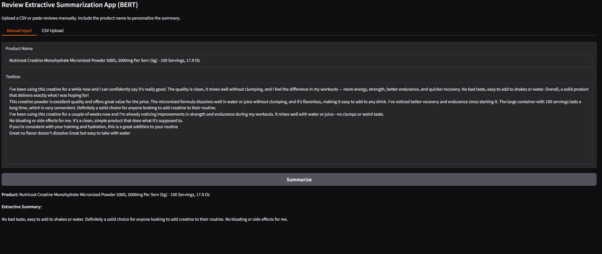
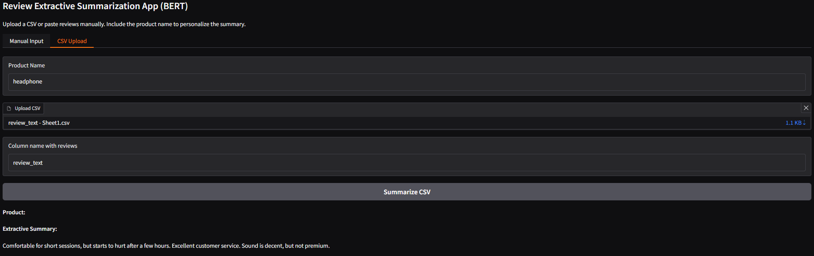

#  Review Extractive Summarization App (BERT + NLTK)

[](https://github.com/cwattsnogueira/rating-predictor-spam-detection-review-summarizer)


<a href="https://colab.research.google.com/github/cwattsnogueira/rating-predictor-spam-detection-review-summarizer/blob/main/15_02_review_summarization_bert_base_uncased.ipynb" target="_parent">
  
</a>

---

##  Purpose

This notebook launches a **Gradio app** that uses **BERT embeddings** and **NLTK sentence tokenization** to generate extractive summaries from product reviews. It supports both manual input and CSV uploads, selecting the most informative sentences based on semantic strength.

---

##  App Interface Overview

###  Manual Input Tab

Users can paste multiple reviews and specify a product name to generate a personalized extractive summary.

####  Example: Summarizing Creatine Reviews



---

###  CSV Upload Tab

Users can upload a CSV file containing reviews and specify the column name to summarize them collectively.

####  Example: Summarizing Headphone Reviews from CSV



---

##  What the Code Does

- Installs required libraries and downloads NLTK's `punkt` tokenizer
- Loads `bert-base-uncased` model and tokenizer from Hugging Face
- Cleans and joins reviews, splits into sentences
- Computes BERT embeddings for each sentence (CLS token)
- Scores sentences using L2 norm and selects top-k
- Preserves original sentence order for readability
- Supports both manual and CSV-based review summarization

---

##  Inputs Supported

| Input Type     | Description |
|----------------|-------------|
| Manual Reviews | Paste multiple reviews directly |
| CSV File       | Upload a CSV with a column containing reviews |

---

##  Output Format

```markdown
**Product:** Wireless Headset

**Extractive Summary:**

The sound quality is excellent and the battery lasts all day. I love how comfortable they feel during long calls. Noise cancellation works surprisingly well even in busy environments.
```

---

##  Budget Justification

| Task                              | Skill Area               | Budget Rationale |
|-----------------------------------|--------------------------|------------------|
| BERT embedding extraction         | NLP + semantic modeling  | High — captures sentence-level meaning |
| NLTK tokenization fallback        | Robust preprocessing     | Medium — ensures resilience |
| Gradio interface design           | UX + interactivity       | High — improves user engagement |
| CSV ingestion                     | Workflow flexibility     | Medium — supports batch summarization |
| Markdown output                   | Presentation clarity     | Medium — improves readability |

---