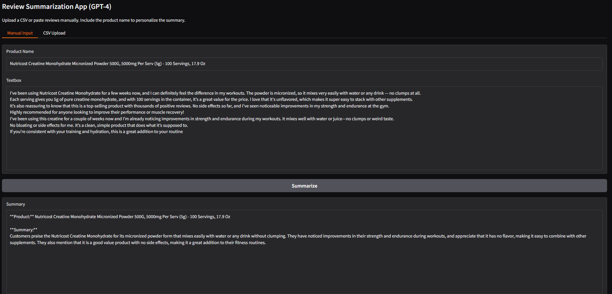
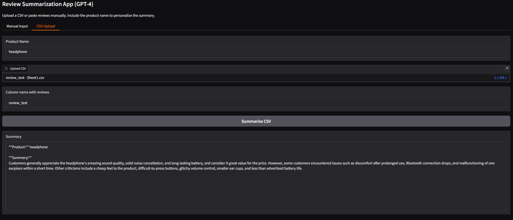

#  Review Summarization App (GPT-4 + Gradio)

[](https://github.com/cwattsnogueira/rating-predictor-spam-detection-review-summarizer)


<a href="https://colab.research.google.com/github/cwattsnogueira/rating-predictor-spam-detection-review-summarizer/blob/main/13_04_review_summarization_gpt4.ipynb" target="_parent">
  
</a>

---

##  Purpose

This notebook launches a **Gradio app** that uses **GPT-4** to generate concise, human-like summaries of product reviews. It supports both manual text input and CSV uploads, and personalizes the output using the product name.

---

##  What the Code Does

- Loads GPT-4 via OpenAI API using a secure key from `userdata.get("OPENAI_API_KEY")`
- Cleans and joins reviews into a single prompt
- Sends prompt to GPT-4 with temperature control for creative summarization
- Returns a 3-sentence summary tailored to the product
- Supports both manual and CSV-based review summarization

---

##  App Interface Overview

###  Manual Input Tab

Users can paste multiple reviews and specify a product name to generate a personalized summary.

####  Example: Summarizing Creatine Reviews



---

###  CSV Upload Tab

Users can upload a CSV file containing reviews and specify the column name to summarize them collectively.

####  Example: Summarizing Headphone Reviews from CSV



---

##  Inputs Supported

| Input Type     | Description |
|----------------|-------------|
| Manual Reviews | Paste multiple reviews directly |
| CSV File       | Upload a CSV with a column containing reviews |

---

##  Output Format

```markdown
**Product:** Wireless Headset

**Summary:**
Customers praise the headset for its clear audio quality and long battery life. Many highlight its comfort during extended use and effective noise cancellation. A few users mentioned minor connectivity issues, but overall satisfaction is high.
```

---

##  API Key Handling

This app uses the OpenAI API via Colab’s `userdata` module. To run it:

1. Store your API key securely in Colab:
   ```python
   from google.colab import userdata
   userdata.set("OPENAI_API_KEY", "sk-...")
   ```
2. Then run the notebook normally.

---

##  Budget Justification

| Task                              | Skill Area               | Budget Rationale |
|-----------------------------------|--------------------------|------------------|
| GPT-4 prompt engineering          | NLP + summarization      | High — enables nuanced, human-like summaries |
| Gradio interface design           | UX + interactivity       | High — improves user engagement |
| CSV ingestion                     | Workflow flexibility     | Medium — supports batch summarization |
| Markdown output                   | Presentation clarity     | Medium — improves readability |
| Secure API key handling           | Deployment hygiene       | Medium — ensures safe access to OpenAI services |

---

