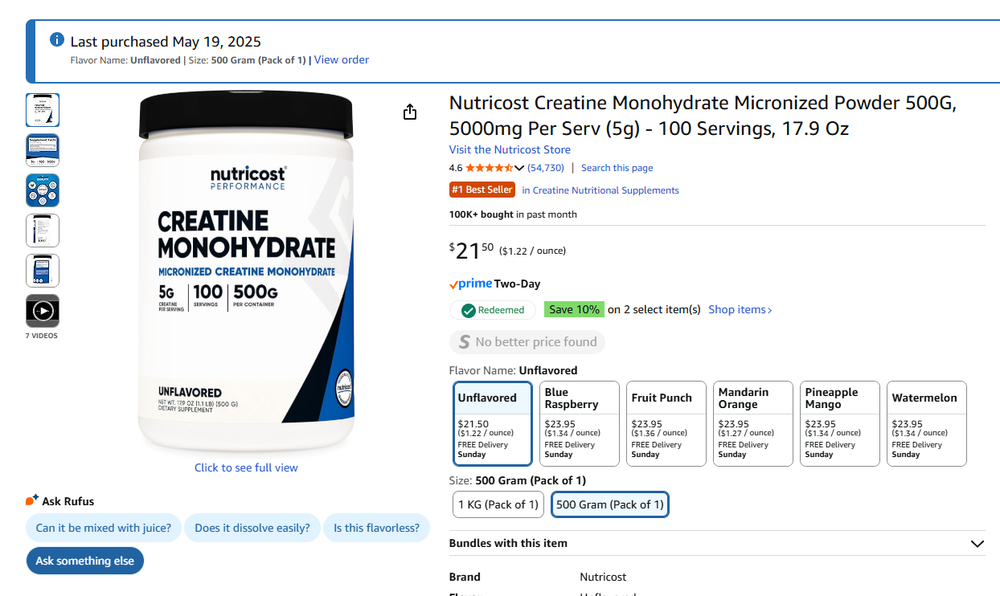
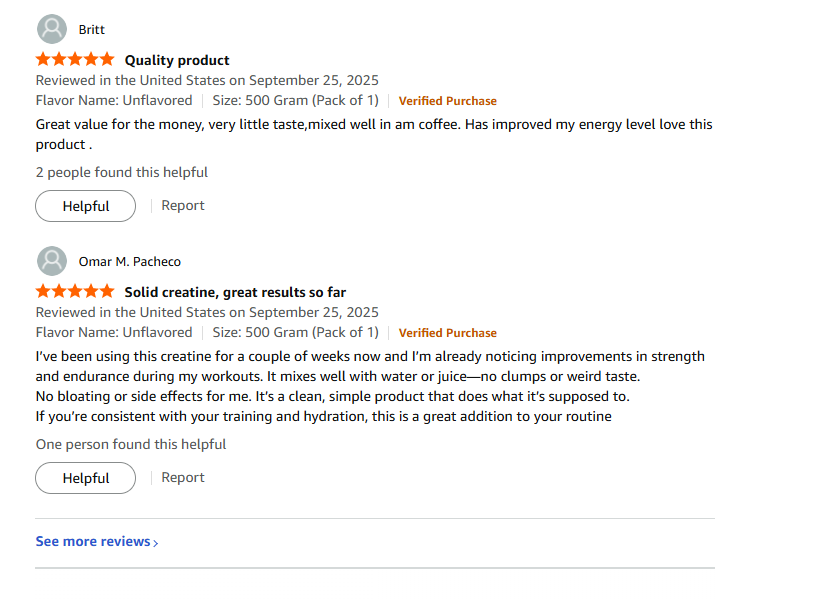
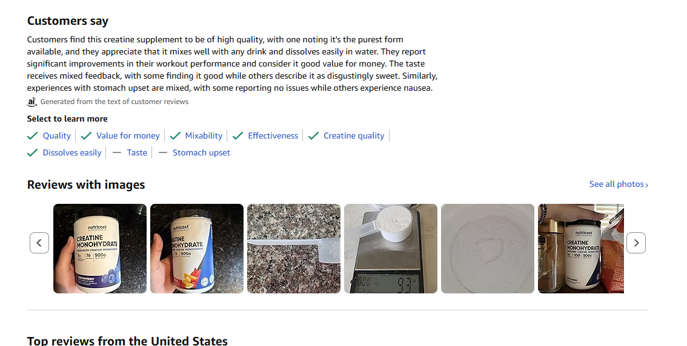

##  1. Problem Statement

**Online retailers face a growing crisis of trust due to fake and misleading product reviews.** Platforms like Amazon, Walmart, and Target are flooded with reviews that distort product ratings, mislead consumers, and unfairly boost dishonest sellers.

### Real-World Impact

- **Amazon** recently won a legal case against a global fake review network operating over 75 fraudulent websites.
- **Walmart and Target** have faced similar challenges, with AI-generated reviews and paid endorsements slipping past moderation.
- **Consumers** often encounter reviews where:
  - ⭐ Star ratings don’t match the sentiment of the text.
  - Reviews are vague, repetitive, or promotional.
  - Suspicious patterns emerge (e.g., identical phrasing across products).

###  Visual Example

-  Real product listing (e.g., Amazon screenshot)  
 

-  Raw customer reviews  
  

-  Summarized customer feedback  
 

---

###  Why It Matters

- **Brand reputation suffers.**
- **Search rankings and conversions are manipulated.**
- **Consumers lose trust in platforms.**
- **Moderation teams are overwhelmed.**

---

