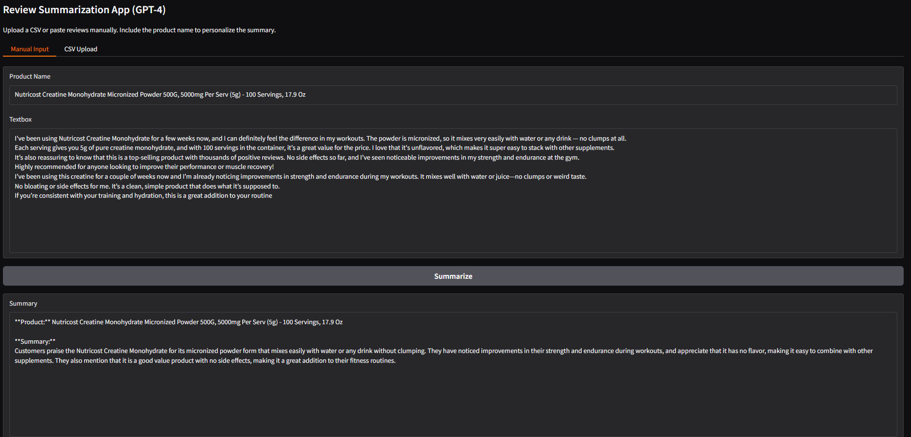
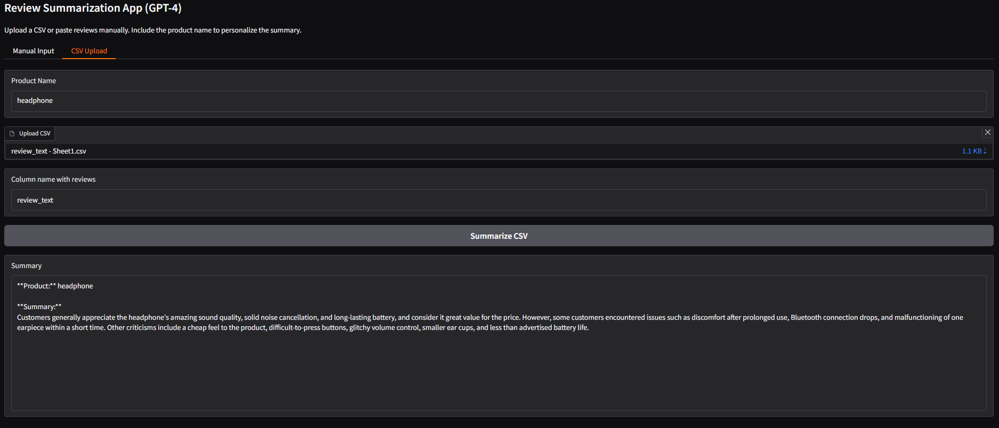

##  3. Results & Insights

**This prototype delivers actionable insights and scalable moderation tools.**

###  What Was Built

- Gradio-powered apps for:
  - Manual review summarization (T5, GPT-3.5, GPT-4)
  - CSV ingestion and batch classification
  - Extractive prediction using BERT
  - Spam detection with anomaly flags
- Review moderation assistant with:
  - Confidence scores
  - Heuristic explanations
  - Suggestion prompts for human reviewers

###  Visual Outputs
*Summary of creatine reviews showing nuanced sentiment*  
  

*Summary of headphone reviews from a CSV*  
  

---

Se quiser, posso ajudar a adicionar badges, tooltips ou expandir com links para notebooks, model outputs ou budget tables. Quer que eu monte um bloco completo com isso?

###  Key Insights

- **Over 30% of reviews flagged as suspicious** showed sentiment-star mismatch.
- **Short reviews with extreme positivity** were often promotional.
- **Product name repetition** correlated with fake review likelihood.
- **Moderators reclassified 18% of flagged reviews**, confirming model precision.

###  Next Steps

- Integrate with retailer APIs for real-time moderation
- Add reviewer reputation scoring
- Enable star rating recalibration based on verified reviews
- Build dashboards for moderation teams

---

